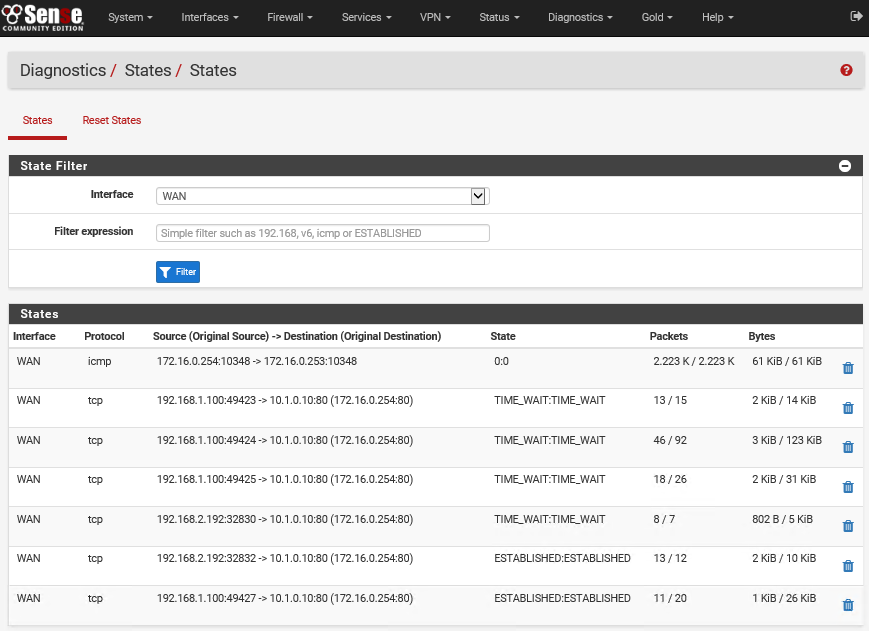
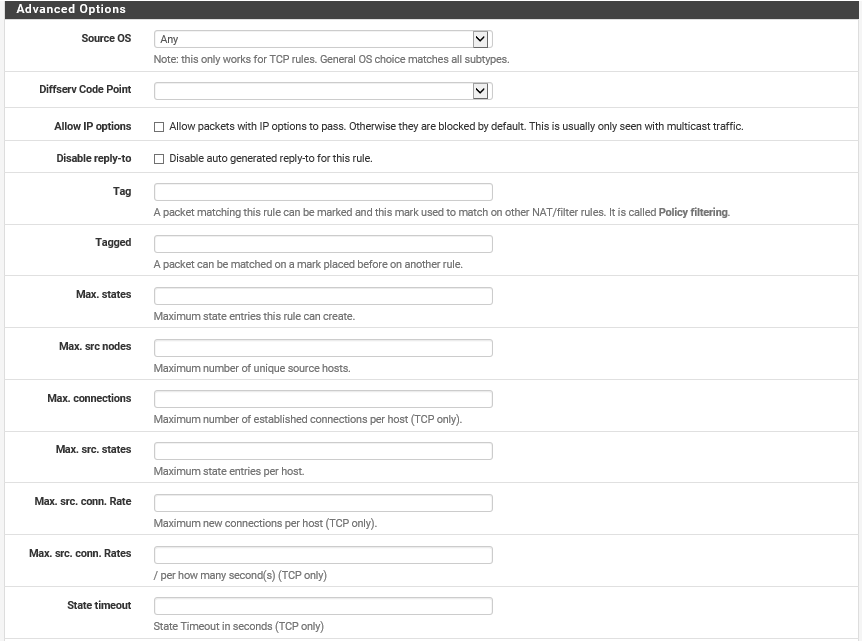

# Stateful Inspection Firewalls

#### STATEFUL INSPECTION FIREWALLS

A **stateful inspection** firewall addresses these problems by tracking information about the session established between two hosts, or blocking malicious attempts to start a bogus session. The vast majority of firewalls now incorporate some level of stateful inspection capability. Session data is stored in a **state table**. When a packet arrives, the firewall checks it to confirm whether it belongs to an existing connection. If it does not, it applies the ordinary packet filtering rules to determine whether to allow it. Once the connection has been allowed, the firewall usually allows traffic to pass unmonitored, in order to conserve processing effort.

_State table in the pfSense firewall appliance. (Screenshot used with permission from Rubicon Communications, LLC.)_

Stateful inspection can occur at two layers: transport and application.

**Transport Layer (OSI Layer 4)**  
At the transport layer, the firewall examines the TCP three-way handshake to distinguish new from established connections. A legitimate TCP connection should follow a SYN > SYN/ACK > ACK sequence to establish a session, which is then tracked using sequence numbers. Deviations from this, such as SYN without ACK or sequence number anomalies, can be dropped as malicious flooding or session hijacking attempts. The firewall can be configured to respond to such attacks by blocking source IP addresses and throttling sessions. It can also track UDP connections, though this is harder as UDP is a connectionless protocol. It is also likely to be able to detect IP header and ICMP anomalies.

_pfSense firewall rule configuration—Advanced settings allow maximums for states and connections to be applied. (Screenshot used with permission from [pfsense.org](https://course.adinusa.id/sections/stateful-inspection-firewalls).)_

**Application Layer (OSI Layer 7)**  
An application-aware firewall can inspect the contents of packets at the application layer. One key feature is to verify the application protocol matches the port; to verify that malware isn't sending raw TCP data over port 80 just because port 80 is open, for instance. As another example, a web application firewall could analyze the HTTP headers and the HTML code present in HTTP packets to try to identify code that matches a pattern in its threat database. Application-aware firewalls have many different names, including application layer gateway, stateful multilayer inspection, or deep packet inspection. Application aware devices have to be configured with separate filters for each type of traffic (HTTP and HTTPS, SMTP/POP/IMAP, FTP, and so on). **Application aware firewalls** are very powerful, but they are not invulnerable. Their very complexity means that it is possible to craft DoS attacks against exploitable vulnerabilities in the firewall firmware. Also, the firewall cannot examine encrypted data packets, unless configured with an SSL/TLS inspector.