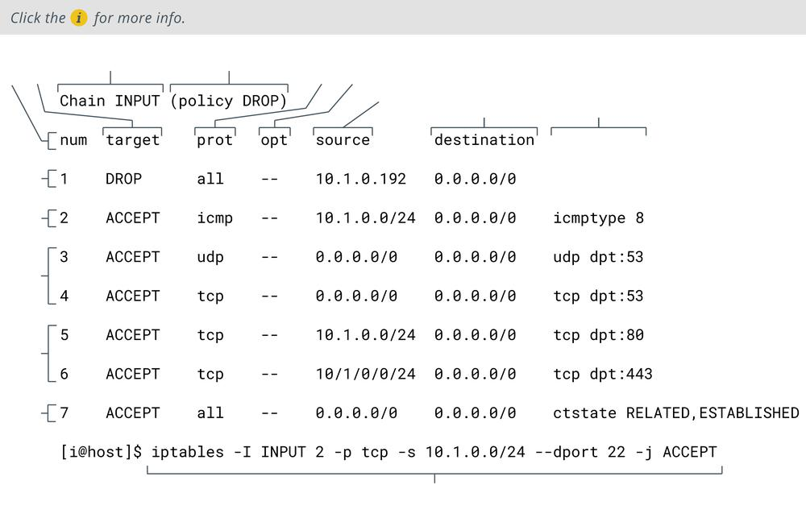

# iptables

#### IPTABLES

`iptables` is a command line utility provided by many Linux distributions that allows administrators to edit the rules enforced by the Linux kernel firewall ([linux.die.net/man/8/iptables](https://course.adinusa.id/sections/iptables)). `iptables` works with chains, which apply to the different types of traffic, such as the INPUT chain for traffic destined for the local host. Each chain has a default policy set to DROP or ALLOW traffic that does not match a rule. Each rule, processed in order, determines whether traffic matching the criteria is allowed or dropped.

The command `iptables --list INPUT --line-numbers -n` will show the contents of the INPUT chain with line numbers and no name resolution. The rules in the following example drop any traffic from the specific host at 10.1.0.192 and allow ICMP echo requests (pings), DNS, and HTTP/HTTPS traffic either from the local subnet (10.1.0.0/24) or from any network (0.0.0.0/0):

```Markdown
Chain INPUT (policy DROP)

# target prot opt source   destination   

1 DROP  all -- 10.1.0.192  0.0.0.0/0 

2 ACCEPT icmp -- 10.10.0.0/24 0.0.0.0/0 icmptype 8

3 ACCEPT udp -- 0.0.0.0/0  0.0.0.0/0  udp dpt:53

4 ACCEPT tcp -- 0.0.0.0/0  0.0.0.0/0  tcp dpt:53

5 ACCEPT tcp -- 10.1.0.0/24 0.0.0.0/0  tcp dpt:80

6 ACCEPT tcp -- 10.1.0.0/24 0.0.0.0/0  tcp dpt:443

7 ACCEPT all -- 0.0.0.0/0  0.0.0.0/0  ctstate RELATED,ESTABLISHED
``` 

The destination 0.0.0.0/0 means "anywhere." When set on the INPUT chain, the effect is to match any IP address that the local host is currently using. The `ctstate` rule is a stateful rule that allows any traffic that is part of an established or related session. As established connections should already have been allowed, this reduces processing requirements to minimize impact on traffic flow.

The following command will insert a new rule as line 2 to allow traffic to the SSH server TCP port (22) from the local subnet:

```Markdown
iptables -I INPUT 2 -p tcp -s 10.1.0.0/24 --dport 22 -j ACCEPT
```

Different switches can be used to append (`-A`), delete (`-D`), or replace (`-R`) rules.



_Access control list entries shown using the command iptables --list INPUT --line-numbers -n with iptables command._