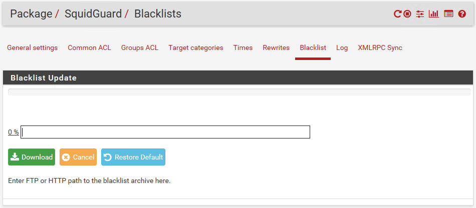
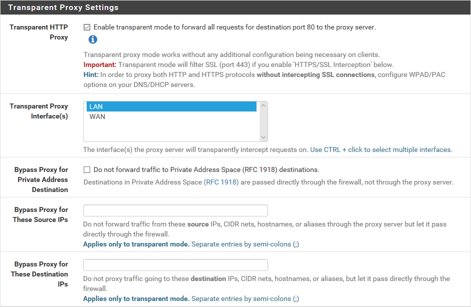

# Proxies and Gateways

#### PROXIES AND GATEWAYS

A firewall that performs application layer filtering is likely to be implemented as a proxy. Where a network firewall only accepts or blocks traffic, a **proxy server** works on a store-and-forward model. The proxy deconstructs each packet, performs analysis, then rebuilds the packet and forwards it on, providing it conforms to the rules.

> _The amount of rebuilding depends on the proxy. Some proxies may only manipulate the IP and TCP headers. Application-aware proxies might add or remove HTTP headers. A deep packet inspection proxy might be able to remove content from an HTTP payload._

**Forward Proxy Servers**  
A forward proxy provides for protocol-specific outbound traffic. For example, you might deploy a web proxy that enables client computers on the LAN to connect to websites and secure websites on the Internet. This is a forward proxy that services TCP ports 80 and 443 for outbound traffic.

_Configuring content filter settings for the Squid proxy server (squid-cache.org) running on pfSense. The filter can apply ACLs and time-based restrictions, and use block lists to prohibit access to URLs. (Screenshot used with permission from Rubicon Communications, LLC.)_

The main benefit of a proxy is that client computers connect to a specified point on the perimeter network for web access. The proxy can be positioned within a DMZ. This provides for a degree of traffic management and security. In addition, most web proxy servers provide **caching engines**, whereby frequently requested web pages are retained on the proxy, negating the need to re-fetch those pages for subsequent requests.

A proxy server must understand the application it is servicing. For example, a web proxy must be able to parse and modify HTTP and HTTPS commands (and potentially HTML and scripts too). Some proxy servers are application-specific; others are multipurpose. A multipurpose proxy is one configured with filters for multiple protocol types, such as HTTP, FTP, and SMTP.

Proxy servers can generally be classed as non-transparent or transparent.

-   A **non-transparent proxy** means that the client must be configured with the proxy server address and port number to use it. The port on which the proxy server accepts client connections is often configured as port 8080.
    
-   A **transparent (or forced or intercepting) proxy**
    
    > intercepts client traffic without the client having to be reconfigured. A transparent proxy must be implemented on a switch or router or other inline network appliance.

_Configuring transparent proxy settings for the Squid proxy server (squid-cache.org) running on pfSense. (Screenshot used with permission from Rubicon Communications, LLC.)_

Both types of proxy can be configured to require users to be authenticated before allowing access. The proxy is likely to be able to use SSO to do this without having to prompt the user for a password.

> _A proxy autoconfiguration (PAC) script allows a client to configure proxy settings without user intervention. The Web Proxy Autodiscovery (WPAD) protocol allows browsers to locate a PAC file. This can be an attack vector, as a malicious proxy on the local network can be used to obtain the user's hash as the browser tries to authenticate ([nopsec.com/responder-beyond-wpad](https://course.adinusa.id/sections/proxies-and-gateways))._

**Reverse Proxy Servers**  
A **reverse proxy** server provides for protocol-specific inbound traffic. For security purposes, you might not want external hosts to be able to connect directly to application servers, such as web, email, and VoIP servers. Instead, you can deploy a reverse proxy on the network edge and configure it to listen for client requests from a public network (the Internet). The proxy applies filtering rules and if accepted, it creates the appropriate request for an application server within a DMZ. In addition, some reverse proxy servers can handle application-specific load balancing, traffic encryption, and caching, reducing the overhead on the application servers.