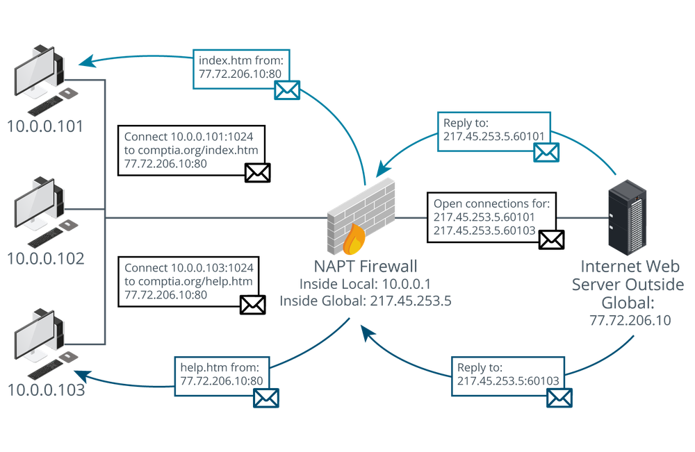
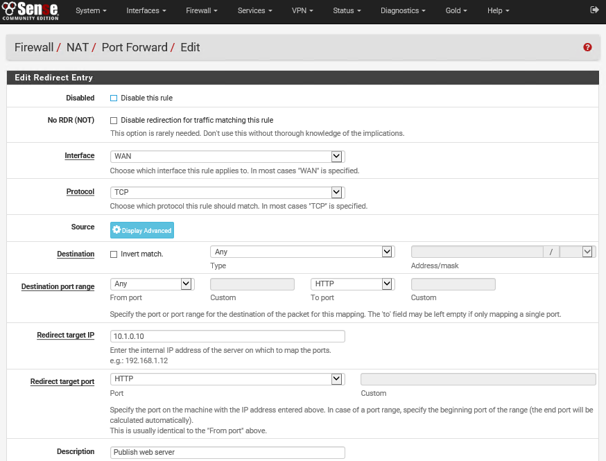

# Network Address Translation

#### NETWORK ADDRESS TRANSLATION

**Network address translation (NAT)** was devised as a way of freeing up scarce IP addresses for hosts needing Internet access. A private network will typically use a private addressing scheme to allocate IP addresses to hosts. These addresses can be drawn from one of the pools of addresses defined in RFC 1918 ([tools.ietf.org/html/rfc1918](https://course.adinusa.id/sections/network-address-translation)) as non-routable over the Internet:

-   10.0.0.0 to 10.255.255.255 (Class A private address range).
    
-   172.16.0.0 to 172.31.255.255 (Class B private address range).
    
-   192.168.0.0 to 192.168.255.255 (Class C private address range).
    

A NAT gateway is a service that translates between the private addressing scheme used by hosts on the LAN and the public addressing scheme used by router, firewall, or proxy server on the network edge. NAT provides security in the sense that it can manage ingress and egress traffic at well-defined points on the network edge, but it is important to realize that it does not perform a filtering function.

There are several types of NAT:

-   Static and dynamic source NAT—perform 1:1 mappings between private ("inside local") network address and public ("inside global") addresses. These mappings can be static or dynamically assigned.
    
-   Overloaded NAT/Network Address Port Translation (NAPT)/**Port Address Translation (PAT)**—provides a means for multiple private IP addresses to be mapped onto a single public address. For example, say two hosts (192.168.0.101 and 192.168.0.102) initiate a web connection at the same time. The NAPT service creates two new port mappings for these requests (192.168.0.101:61101 and 192.168.0.102:61102). It then substitutes the private IPs for the public IP and forwards the requests to the public Internet. It performs a reverse mapping on any traffic returned using those ports, inserting the original IP address and port number, and forwards the packets to the internal hosts.

_NAT overloading. (Image © 123RF.com.)_

-   **Destination NAT/port forwarding**—uses the router's public address to publish a web service, but forwards incoming requests to a different IP. Port forwarding means that the router takes requests from the Internet for a particular application (say, HTTP/port 80) and sends them to a designated host and port in the DMZ or LAN.

_Configuring port forwarding on a pfSense firewall appliance—This rule forwards any HTTP traffic received on the appliance's WAN interface to the 10.1.0.10 host on the LAN. (Screenshot used with permission from [pfsense.org](https://course.adinusa.id/sections/network-address-translation).)_

> _The larger IPv6 address space makes most use cases for NAT redundant. A host can use a link-local address to contact neighboring nodes, but any routed traffic should use a globally unique address. In IPv6 it is routing policies and firewall filtering that manage which hosts and networks are reachable. That said, there are mechanisms for translating prefixes at the network edge (NPTv6) and for translation between IPv6 addresses (NAT66) or IPv6 and IPv4 addresses (NAT64 and NAT46)._