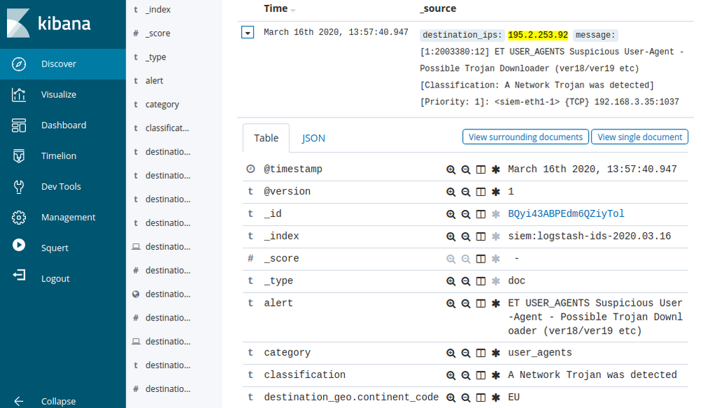

# Network-Based Intrusion Detection Systems

#### NETWORK-BASED INTRUSION DETECTION SYSTEMS

An **intrusion detection system (IDS)** is a means of using software tools to provide real-time analysis of either network traffic or system and application logs. A **network-based IDS (NIDS)** captures traffic via a packet sniffer, referred to as a sensor. It analyzes the packets to identify malicious traffic and displays alerts to a console or dashboard.

A NIDS, such as **Snort** ([snort.org](https://course.adinusa.id/sections/network-based-intrusion-detection-systems)), Suricata ([suricata-ids.org](https://course.adinusa.id/sections/network-based-intrusion-detection-systems)), or Zeek/Bro ([zeek.org](https://course.adinusa.id/sections/network-based-intrusion-detection-systems)) performs passive detection. When traffic is matched to a detection signature, it raises an alert or generates a log entry, but does not block the source host. This type of passive sensor does not slow down traffic and is undetectable by the attacker. It does not have an IP address on the monitored network segment.

A NIDS is used to identify and log hosts and applications and to detect attack signatures, password guessing attempts, port scans, worms, backdoor applications, malformed packets or sessions, and policy violations (ports or IP addresses that are not permitted, for instance). You can use analysis of the logs to tune firewall rulesets, remove or block suspect hosts and processes from the network, or deploy additional security controls to mitigate any threats you identify.

_Viewing an intrusion detection alert generated by Snort in the Kibana app on Security Onion. (Screenshot Security Onion [securityonion.net](https://course.adinusa.id/sections/network-based-intrusion-detection-systems).)_