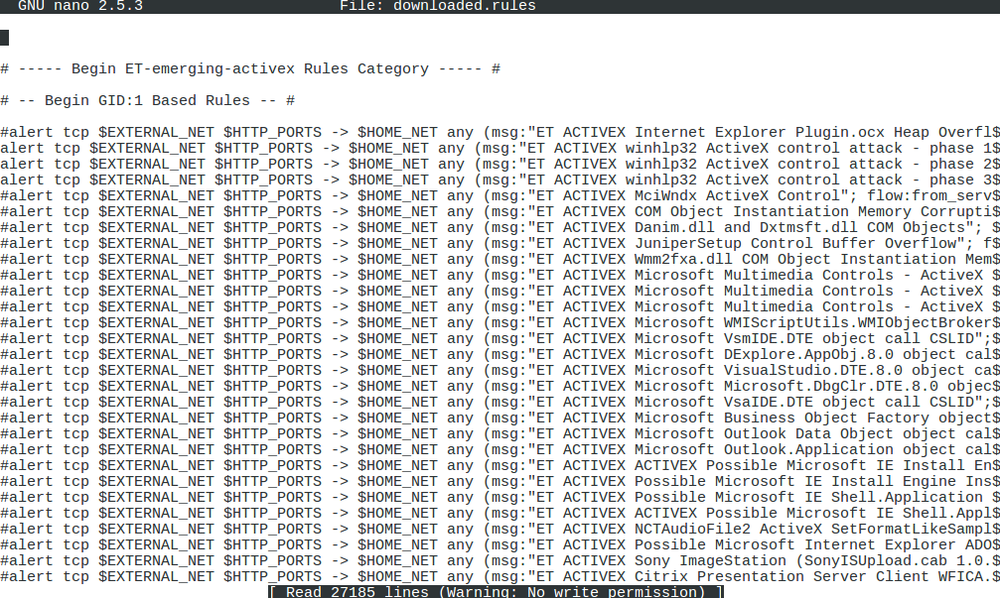

# Signature-Based Detection

#### SIGNATURE-BASED DETECTION

In an IDS, the analysis engine is the component that scans and interprets the traffic captured by the sensor with the purpose of identifying suspicious traffic. The analysis engine determines how any given event should be classed, with typical options to ignore, log only, alert, and block (IPS). The analysis engine is programmed with a set of rules that it uses to drive its decision-making process. There are several methods of formulating the ruleset.

**Signature-based detection** (or pattern-matching) means that the engine is loaded with a database of attack patterns or signatures. If traffic matches a pattern, then the engine generates an incident.

_Snort rules file supplied by the open-source Emerging Threats community feed._

The signatures and rules (often called plug-ins or feeds) powering intrusion detection need to be updated regularly to provide protection against the latest threat types. Commercial software requires a paid-for subscription to obtain the updates. It is important to ensure that the software is configured to update only from valid repositories, ideally using a secure connection method, such as HTTPS.