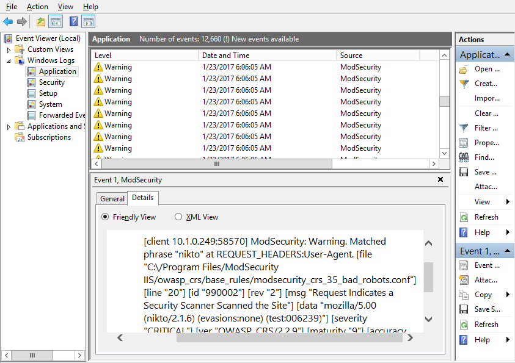

# Web Application Firewalls

#### WEB APPLICATION FIREWALLS

A **web application firewall (WAF)** is designed specifically to protect software running on web servers and their back-end databases from code injection and DoS attacks. WAFs use application-aware processing rules to filter traffic and perform application-specific intrusion detection. The WAF can be programmed with signatures of known attacks and use pattern matching to block requests containing suspect code. The output from a WAF will be written to a log, which you can inspect to determine what threats the web application might be subject to.

_With the ModSecurity WAF installed to this IIS server, a scanning attempt has been detected and logged as an Application event. As you can see, the default ruleset generates a lot of events. (Screenshot used with permission from Microsoft.)_

A WAF may be deployed as an appliance or as plug-in software for a web server platform. Some examples of WAF products include:

-   ModSecurity ([modsecurity.org](https://course.adinusa.id/sections/web-application-firewalls)) is an open source (sponsored by Trustwave) WAF for Apache, nginx, and IIS.
    
-   NAXSI ([github.com/nbs-system/naxsi](https://course.adinusa.id/sections/web-application-firewalls)) is an open source module for the nginx web server software.
    
-   Imperva ([imperva.com](https://course.adinusa.id/sections/web-application-firewalls)) is a commercial web security offering with a particular focus on data centers. Imperva markets WAF, DDoS, and database security through its SecureSphere appliance.