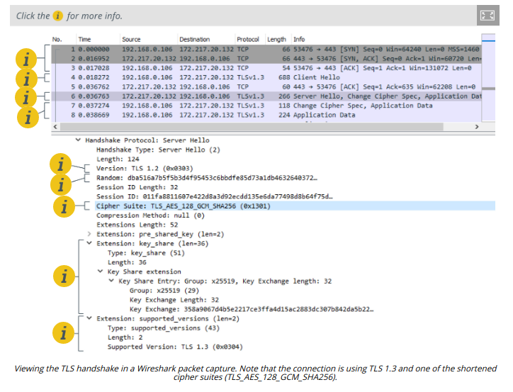

# TRANSPORT LAYER SECURITY

#### TRANSPORT LAYER SECURITY

As with other early TCP/IP application protocols, HTTP communications are not secured. Secure Sockets Layer (SSL) was developed by Netscape in the 1990s to address the lack of security in HTTP. SSL proved very popular with the industry, and it was quickly adopted as a standard named **Transport Layer Security (TLS)**. It is typically used with HTTP (referred to as HTTPS or HTTP Secure) but can also be used to secure other application protocols and as a virtual private networking (VPN) solution.

To implement TLS, a server is assigned a digital certificate signed by some trusted certificate authority (CA). The certificate proves the identity of the server (assuming that the client trusts the CA) and validates the server's public/private key pair. The server uses its key pair and the TLS protocol to agree mutually supported ciphers with the client and negotiate an encrypted communications session.

> _HTTPS operates over port 443 by default. HTTPS operation is indicated by using https:// for the URL and by a padlock icon shown in the browser._

It is also possible to install a certificate on the client so that the server can trust the client. This is not often used on the web but is a feature of VPNs and enterprise networks that require mutual authentication.

**SSL/TLS Versions**  
While the acronym SSL is still used, the Transport Layer Security versions are the only ones that are safe to use. A server can provide support for legacy clients, but obviously this is less secure. For example, a TLS 1.2 server could be configured to allow clients to downgrade to TLS 1.1 or 1.0 or even SSL 3.0 if they do not support TLS 1.2.

> _A downgrade attack is where a man-in-the-middle tries to force the use of a weak cipher suite and SSL/TLS version._

TLS version 1.3 was approved in 2018. One of the main features of TLS 1.3 is the removal of the ability to perform downgrade attacks by preventing the use of unsecure features and algorithms from previous versions. There are also changes to the handshake protocol to reduce the number of messages and speed up connections.

**Cipher Suites**  
A cipher suite is the algorithms supported by both the client and server to perform the different encryption and hashing operations required by the protocol. Prior to TLS 1.3, a cipher suite would be written in the following form:

```Markdown
ECDHE-RSA-AES128-GCM-SHA256
``` 

This means that the server can use Elliptic Curve Diffie-Hellman Ephemeral mode for session key agreement, RSA signatures, 128-bit AES-GCM (Galois Counter Mode) for symmetric bulk encryption, and 256-bit SHA for HMAC functions. Suites the server prefers are listed earlier in its supported cipher list.

TLS 1.3 uses simplified and shortened suites. A typical TLS 1.3 cipher suite appears as follows:

```Markdown
TLS_AES_256_GCM_SHA384
``` 

Only ephemeral key agreement is supported in 1.3 and the signature type is supplied in the certificate, so the cipher suite only lists the bulk encryption key strength and mode of operation (AES\_256\_GCM), plus the cryptographic hash algorithm (SHA384) used within the new hash key derivation function (HKDF). HKDF is the mechanism by which the shared secret established by DH key agreement is used to derive symmetric session keys.

