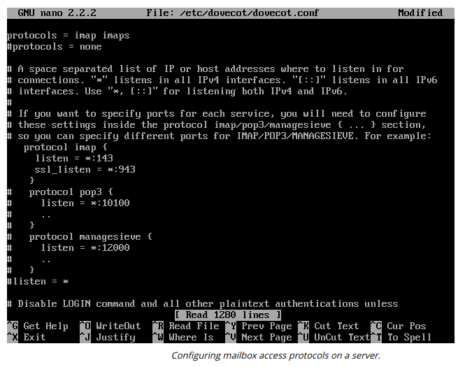

# EMAIL SERVICES

#### EMAIL SERVICES

Email services use two types of protocols:

-   The **Simple Mail Transfer Protocol (SMTP)** transmits email messages from one system to another.
  
-   The **Post Office Protocol v3 (POP3)** receives email messages from an email server to store on a client computer.
  

**Secure SMTP (SMTPS)**  
A sender’s SMTP server discovers the IP address of the recipient’s SMTP server using the domain name of the recipient’s email address. The SMTP server for the domain is registered in DNS using a Mail Exchanger (MX) record.

SMTP communications can be secured using TLS. This works much like HTTPS with a certificate on the SMTP server. There are two ways for SMTP to use TLS:

-   STARTTLS—this is a command that upgrades an existing unsecure connection to use TLS. This is also referred to as explicit TLS or opportunistic TLS.
  
-   SMTPS—this establishes the secure connection before any SMTP commands (HELO, for instance) are exchanged. This is also referred to as implicit TLS.
  

The STARTTLS method is generally more widely implemented than SMTPS. Typical SMTP configurations use the following ports and secure services:

  
-   Port 25—used for message relay (between SMTP servers or Message Transfer Agents \[MTA\]). If security is required and supported by both servers, the STARTTLS command can be used to set up the secure connection.
  
-   Port 587—used by mail clients (Message Submission Agents \[MSA\]) to submit messages for delivery by an SMTP server. Servers configured to support port 587 should use STARTTLS and require authentication before message submission.
  
-   Port 465—some providers and mail clients use this port for message submission over implicit TLS (SMTPS), though this usage is now deprecated by standards documentation.

  
**Secure POP (POP3S)**  
When a recipient’s email client connects to a server mailbox, POP3 downloads the email messages.

A POP3 client application, such as Microsoft Outlook or Mozilla Thunderbird, establishes a TCP connection to the POP3 server over port 110. The user is authenticated (by username and password) and the contents of his or her mailbox are downloaded for processing on the local PC. POP3S is the secured version of the protocol, operating over TCP port 995 by default.

**Secure IMAP (IMAPS)**  
Compared to POP3, the **Internet Message Access Protocol v4 (IMAP4)** supports permanent connections to a server and connecting multiple clients to the same mailbox simultaneously. It also allows a client to manage mail folders on the server. Clients connect to IMAP over TCP port 143. They authenticate themselves then retrieve messages from the designated folders. As with other email protocols, the connection can be secured by establishing an SSL/TLS tunnel. The default port for IMAPS is TCP port 993.