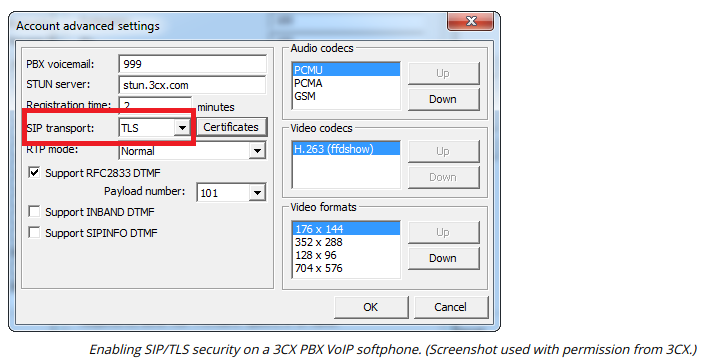
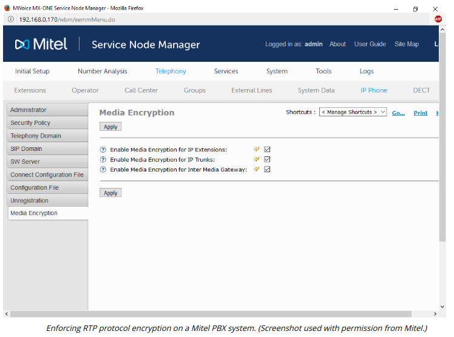

# VOICE AND VIDEO SERVICES

#### VOICE AND VIDEO SERVICES

**Voice over IP (VoIP)**, web conferencing, and video teleconferencing (VTC) solutions have become standard methods for the provision of business communications. The main challenges that these applications have in common is that they transfer real-time data and must create point-to-point links between hosts on different networks.

Implementing Internet telephony and video conferencing brings its own raft of security concerns. Each part of the communications media network infrastructure needs to be evaluated for threats and vulnerabilities. This includes protocols, servers, handsets, and software. The protocols designed to support real-time services cover one or more of the following functions:

-   Session control—used to establish, manage, and disestablish communications sessions. They handle tasks such as user discovery (locating a user on the network), availability advertising (whether a user is prepared to receive calls), negotiating session parameters (such as use of audio/video), and session management and termination.
  
-   Data transport—handles the delivery of the actual video or voice information.
  
-   Quality of Service (QoS)—provides information about the connection to a QoS system, which in turn ensures that voice or video communications are free from problems such as dropped packets, delay, or jitter.
  

The **Session Initiation Protocol (SIP)** is one of the most widely used session control protocols. SIP endpoints are the end-user devices (also known as user-agents), such as IP-enabled handsets or client and server web conference software. Each device, conference, or telephony user is assigned a unique SIP address known as a SIP Uniform Resource Indicator (URI), such as sip:bob.dobbs@comptia.org

SIP endpoints can establish communications directly in a peer-to-peer architecture, but it is more typical to use intermediary servers and directory servers. A SIP network may also use gateways and private branch exchange (PBX) appliances to provide an interface between the VoIP network and external telephone and cellular networks.

While SIP provides session management features, the actual delivery of real-time data uses different protocols. The principal one is **Real-time Transport Protocol (RTP)**.

A threat actor could exploit unencrypted voice and video communications to try to intercept passwords, credit card details, and so on. Without strong mutual authentication, connections are also vulnerable to man-in-the-middle attacks.

Connection security for voice and video works in a similar manner to HTTPS. To initiate the call, the secure version SIPS uses digital certificates to authenticate the endpoints and establish a TLS tunnel. Where unencrypted SIP typically runs over TCP port 5060, SIPS uses TCP port 5061. The secure connection established by SIPS can also be used to generate a master key to use with the secure versions of the transport protocol (**SRTP**). SRTP provides confidentiality for the actual call data.

