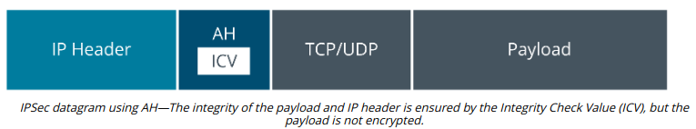
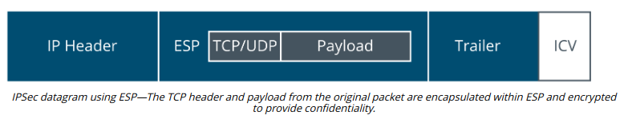

# INTERNET PROTOCOL SECURITY

#### INTERNET PROTOCOL SECURITY

Transport Layer Security is applied at the application level, either by using a separate secure port or by using commands in the application protocol to negotiate a secure connection. **Internet Protocol Security (IPSec)** operates at the network layer (layer 3) of the OSI model, so it can be implemented without having to configure specific application support. IPSec can provide both confidentiality (by encrypting data packets) and integrity/anti-replay (by signing each packet). The main drawback is that it adds overhead to data communications. IPSec can be used to secure communications on local networks and as a remote access protocol.

> _When IPv6 was being drafted, IPSec was considered a mandatory component as it was felt that all traffic over the new protocol should be secure. In recent years, RFCs have been revised so that now, IPSec is recommended for IPv6 but no longer mandatory (tools.ietf.org/html/rfc6434#page-17)._

Each host that uses IPSec must be assigned a policy. An IPSec policy sets the authentication mechanism and also the protocols and mode for the connection. Hosts must be able to match at least one matching security method for a connection to be established. There are two core protocols in IPSec, which can be applied singly or together, depending on the policy.

**Authentication Header (AH)**  
The **Authentication Header (AH)** protocol performs a cryptographic hash on the whole packet, including the IP header, plus a shared secret key (known only to the communicating hosts), and adds this HMAC in its header as an Integrity Check Value (ICV). The recipient performs the same function on the packet and key and should derive the same value to confirm that the packet has not been modified. The payload is not encrypted so this protocol does not provide confidentiality. Also, the inclusion of IP header fields in the ICV means that the check will fail across NAT gateways, where the IP address is rewritten. Consequently, AH is not often used.

**Encapsulation Security Payload (ESP)**  
**Encapsulation Security Payload (ESP)** provides confidentiality and/or authentication and integrity. It can be used to encrypt the packet rather than simply calculating an HMAC. ESP attaches three fields to the packet: a header, a trailer (providing padding for the cryptographic function), and an Integrity Check Value. Unlike AH, ESP excludes the IP header when calculating the ICV.

> _With ESP, algorithms for both confidentiality (symmetric cipher) and authentication/integrity (hash function) are usually applied together. It is possible to use one or the other, however._