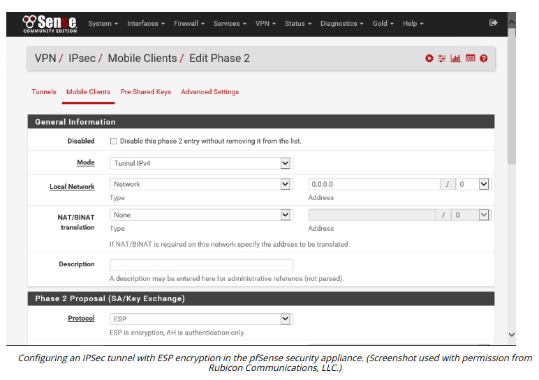

# IPSEC TRANSPORT AND TUNNEL MODES

#### IPSEC TRANSPORT AND TUNNEL MODES

IPSec can be used in two modes:

-   Transport mode—this mode is used to secure communications between hosts on a private network (an end-to-end implementation). When ESP is applied in transport mode, the IP header for each packet is not encrypted, just the payload data. If AH is used in transport mode, it can provide integrity for the IP header.
  

-   Tunnel mode—this mode is used for communications between VPN gateways across an unsecure network (creating a VPN). This is also referred to as a router implementation. With ESP, the whole IP packet (header and payload) is encrypted and encapsulated as a datagram with a new IP header. AH has no real use case in tunnel mode, as confidentiality will usually be required.

  

> _The principles underlying IPSec are the same for IPv4 and IPv6, but the header formats are different. IPSec makes use of extension headers in IPv6 while in IPv4, ESP and AH are allocated new IP protocol numbers (50 and 51), and either modify the original IP header or encapsulate the original packet, depending on whether transport or tunnel mode is used._