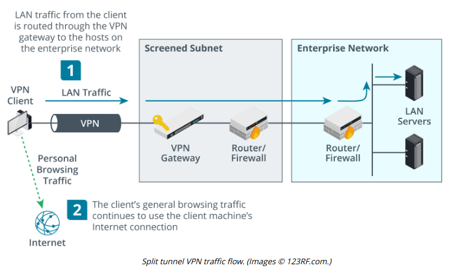
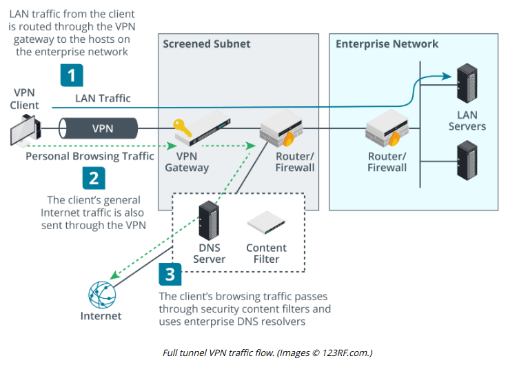

# VPN CLIENT CONFIGURATION

#### VPN CLIENT CONFIGURATION

To configure a VPN client, you may need to install the client software if the VPN type is not natively supported by the OS. For example, OpenVPN requires client installation. You then configure the client with the address of the VPN gateway, the VPN protocol type (if it cannot autodetect it), the username, and the account credentials. You may also need to deploy a client certificate that is trusted by the VPN concentrator to the machine and make that available to the VPN client. In addition, you might need to configure settings for how the VPN connection operates.

**Always-On VPN**  
Traditional remote access VPN solutions require the user to initiate the connection and enter their authentication credentials. An always-on VPN means that the computer establishes the VPN whenever an Internet connection over a trusted network is detected, using the user's cached credentials to authenticate. Microsoft has an Always-On VPN solution for Windows Server and Windows 10 clients (docs.microsoft.com/en-us/windows-server/remote/remote-access/vpn/always-on-vpn/deploy/always-on-vpn-deploy-deployment) and an OpenVPN client can be configured to autoconnect (openvpn.net/vpn-server-resources/setting-your-client-to-automatically-connect-to-your-vpn-when-your-computer-starts).

**Split Tunnel versus Full Tunnel**  
When a client connected to a remote access VPN tries to access other sites on the Internet, there are two ways to manage the connection:

-   **Split tunnel**—the client accesses the Internet directly using its "native" IP configuration and DNS servers.
  

-   **Full tunnel**—Internet access is mediated by the corporate network, which will alter the client's IP address and DNS servers and may use a proxy.

  

Full tunnel offers better security, but the network address translations and DNS operations required may cause problems with some websites, especially cloud services. It also means more data is channeled over the link.

