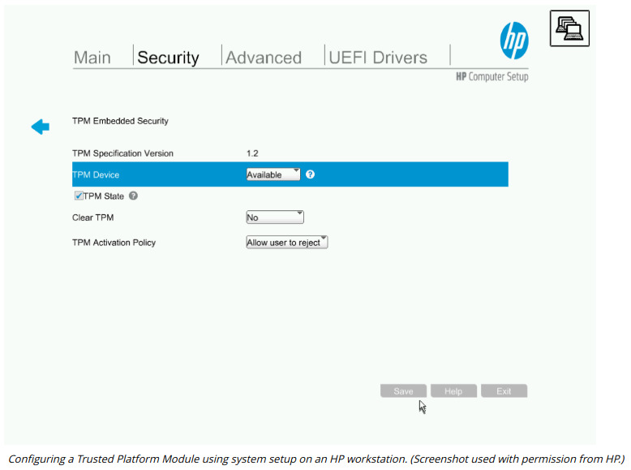

# HARDWARE ROOT OF TRUST

#### HARDWARE ROOT OF TRUST

A **hardware Root of Trust (RoT)** or trust anchor is a secure subsystem that is able to provide attestation. Attestation means that a statement made by the system can be trusted by the receiver. For example, when a computer joins a network, it might submit a report to the network access control (NAC) server declaring, "My operating system files have not been replaced with malicious versions." The hardware root of trust is used to scan the boot metrics and OS files to verify their signatures, then it signs the report. The NAC server can trust the signature and therefore the report contents if it can trust that the signing entity's private key is secure.

The RoT is usually established by a type of cryptoprocessor called a **trusted platform module (TPM)**. TPM is a specification for hardware-based storage of encryption keys, hashed passwords, and other user and platform identification information. The TPM is implemented either as part of the chipset or as an embedded function of the CPU.

Each TPM is hard-coded with a unique, unchangeable asymmetric private key called the endorsement key. This endorsement key is used to create various other types of subkeys used in key storage, signature, and encryption operations. The TPM also supports the concept of an owner, usually identified by a password (though this is not mandatory). Anyone with administrative control over the setup program can take ownership of the TPM, which destroys and then regenerates its subkeys. A TPM can be managed in Windows via the tpm.msc console or through group policy. On an enterprise network, provisioning keys to the TPM might be centrally managed via the Key Management Interoperability Protocol (KMIP).

The problem with establishing a hardware root of trust is that devices are used in environments where anyone can get complete control over them. There cannot be complete assurance that the firmware underpinning the hardware root of trust is inviolable, but attacks against trusted modules are sufficiently difficult so as to provide effective security in most cases.