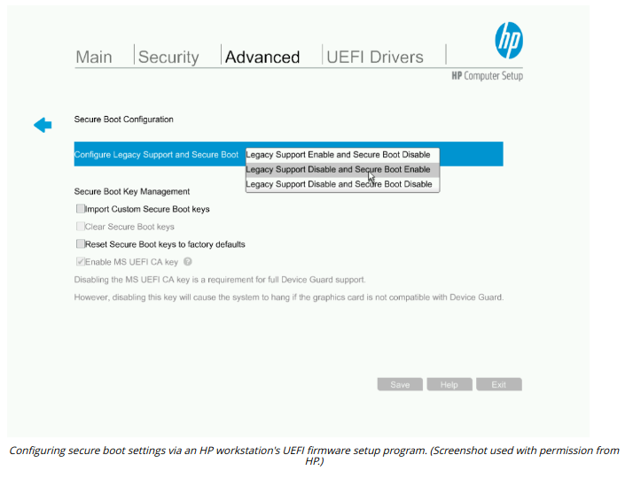

# BOOT INTEGRITY

#### BOOT INTEGRITY

Most PCs and smartphones implement the **unified extensible firmware interface (UEFI)**. UEFI provides code that allows the host to boot to an OS. UEFI can enforce a number of boot integrity checks.

**Secure Boot**  
**Secure boot** is designed to prevent a computer from being hijacked by a malicious OS. UEFI is configured with digital certificates from valid OS vendors. The system firmware checks the operating system boot loader and kernel using the stored certificate to ensure that it has been digitally signed by the OS vendor. This prevents a boot loader or kernel that has been changed by malware (or an OS installed without authorization) from being used. Secure boot is supported on Windows (docs.microsoft.com/en-us/windows/security/information-protection/secure-the-windows-10-boot-process) and many Linux platforms (wiki.ubuntu.com/UEFI/SecureBoot). Secure boot requires UEFI, but does not require a TPM.

**Measured Boot**  
A trusted or **measured boot** process uses platform configuration registers (PCRs) in the TPM at each stage in the boot process to check whether hashes of key system state data (boot firmware, boot loader, OS kernel, and critical drivers) have changed. This does not usually prevent boot, but it will record the presence of unsigned kernel-level code.

**Boot Attestation**  
**Boot attestation** is the capability to transmit a boot log report signed by the TPM via a trusted process to a remote server, such as a network access control server. The boot log can be analyzed for signs of compromise, such as the presence of unsigned drivers. The host can be prevented from accessing the network if it does not meet the required health policy or if no attestation report is received.

