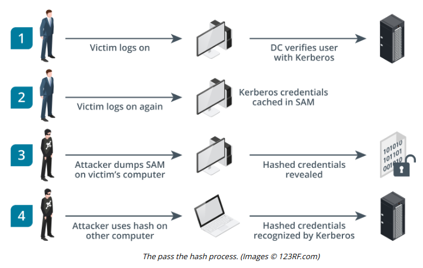

# PASS THE HASH ATTACK

#### PASS THE HASH ATTACK

A threat actor has to be either relatively lucky to find an unpatched vulnerability, or well-resourced enough to develop a zero-day exploit. Once an initial foothold has been gained, the threat actor may try to find simpler ways to move around the network.

Attackers can extend their lateral movement by a great deal if they are able to compromise host credentials. One common credential exploit technique for lateral movement is called **pass the hash (PtH)**. This is the process of harvesting an account's cached credentials when the user is logged into a single sign-on (SSO) system so the attacker can use the credentials on other systems. If the threat actor can obtain the hash of a user password, it is possible to present the hash (without cracking it) to authenticate to network protocols such as the Windows File Sharing protocol Server Message Block (SMB), and other protocols that accept NTLM hashes as authentication credentials. For example, most Windows domain networks are configured to allow NTLM as a legacy authentication method for services. The attacker's access isn't just limited to a single host, as they can pass the hash onto any computer in the network that is tied to the domain. This drastically cuts down on the effort the threat actor must spend in moving from host to host.

Pass the hash is relatively difficult to detect, as it exploits legitimate network behavior. A detection system can be configured to correlate a sequence of security log events using NTLM-type authentication, but this method can be prone to false positives (blog.stealthbits.com/how-to-detect-pass-the-hash-attacks/).

