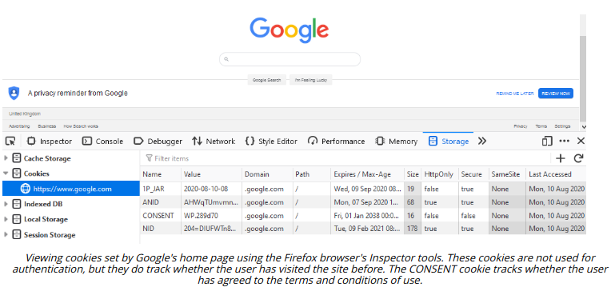

# REPLAY ATTACKS

#### REPLAY ATTACKS

Session management enables web applications to uniquely identify a user across a number of different actions and requests. Session management is particularly important when it comes to user authentication, as it is required to ensure the integrity of the account and the confidentiality of data associated with it. Session management is often vulnerable to different kinds of replay attack. To establish a session, the server normally gives the client some type of token. A **replay attack** works by sniffing or guessing the token value and then submitting it to re-establish the session illegitimately.

HTTP is nominally a stateless protocol, meaning that the server preserves no information about the client, but mechanisms such as cookies have been developed to preserve stateful data. A cookie is created when the server sends an HTTP response header with the cookie data. A cookie has a name and value, plus optional security and expiry attributes. Subsequent request headers sent by the client will usually include the cookie. Cookies are either nonpersistent (session) cookies, in which case they are stored in memory and deleted when the browser instance is closed, or persistent, in which case they are stored in the browser cache until deleted by the user or pass a defined expiration date.

If cookies are used to store confidential information, the web application should encrypt them before sending them to the client. If using TLS, information in a cookie would be secure in transit but reside on the client computer in plaintext, unless it had been separately encrypted. The value can be any URL-safe encoded string in whatever format and structure the application uses for parsing.

