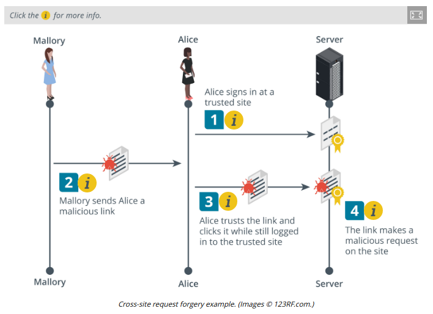

# SESSION HIJACKING AND CROSS-SITE REQUEST FORGERY

#### SESSION HIJACKING AND CROSS-SITE REQUEST FORGERY

In the context of a web application, **session hijacking** most often means replaying a cookie in some way. Attackers can sniff network traffic to obtain session cookies sent over an unsecured network, like a public Wi-Fi hotspot. To counter cookie hijacking, you can encrypt cookies during transmission, delete cookies from the client's browser cache when the client terminates the session, and design your web app to deliver a new cookie with each new session between the app and the client's browser.

Session prediction attacks focus on identifying possible weaknesses in the generation of session tokens that will enable an attacker to predict future valid session values. If an attacker can predict the session token, then the attacker can take over a session that has yet to be established. A session token must be generated using a non-predictable algorithm, and it must not reveal any information about the session client. In addition, proper session management dictates that apps limit the lifespan of a session and require reauthentication after a certain period.

**Cross-Site Request Forgery**  
A **client-side or cross-site request forgery (CSRF or XSRF)** can exploit applications that use cookies to authenticate users and track sessions. To work, the attacker must convince the victim to start a session with the target site. The attacker must then pass an HTTP request to the victim's browser that spoofs an action on the target site, such as changing a password or an email address. This request could be disguised in a few ways and so could be accomplished without the victim necessarily having to click a link. If the target site assumes that the browser is authenticated because there is a valid session cookie and doesn't complete any additional authorization process on the attacker's input (or if the attacker is able to spoof the authorization), it will accept the input as genuine. This is also referred to as a confused deputy attack (the point being that the user and the user's browser are not necessarily the same thing).

**Clickjacking**  
**Clickjacking** is an attack where what the user sees and trusts as a web application with some sort of login page or form contains a malicious layer or invisible iFrame that allows an attacker to intercept or redirect user input. Clickjacking can be launched using any type of compromise that allows the adversary to run arbitrary code as a script. Clickjacking can be mitigated by using HTTP response headers that instruct the browser not to open frames from different origins (domains) and by ensuring that any buttons or input boxes on a page are positioned on the top-most layer.

**SSL Strip**  
A Secure Sockets Layer (SSL) strip attack is launched against clients on a local network as they try to make connections to websites. The threat actor must first perform a Man-in-the-Middle attack via ARP poisoning to masquerade as the default gateway. When a client requests an HTTP site that redirects to an HTTPS site in an unsafe way, the sslstrip utility (tools.kali.org/information-gathering/sslstrip) proxies the request and response, serving the client the HTTP site, hopefully with an unencrypted login form. If the user enters credentials, they will be captured by the threat actor. Sites can use the HTTP Strict Transport Security (HSTS) lists maintained by browsers to prevent clients requesting HTTP in the first place.