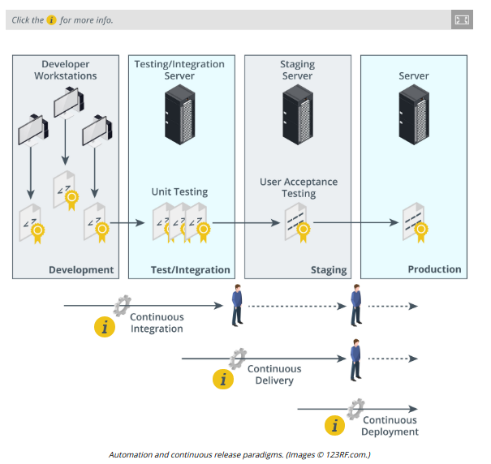

# AUTOMATION/SCRIPTING RELEASE PARADIGMS

#### AUTOMATION/SCRIPTING RELEASE PARADIGMS

Coding projects are managed using different life cycle models. The waterfall model software development life cycle (SDLC) is an older paradigm that focuses on the successful completion of monolithic projects that progress from stage-to-stage. The more recent Agile paradigm uses iterative processes to release well-tested code in smaller blocks or units. In this model, development and provisioning tasks are conceived as continuous.

**Continuous Integration**  
**Continuous integration (CI)** is the principle that developers should commit and test updates often—every day or sometimes even more frequently. This is designed to reduce the chances of two developers spending time on code changes that are later found to conflict with one another. CI aims to detect and resolve these conflicts early, as it is easier to diagnose one or two conflicts or build errors than it is to diagnose the causes of tens of them. For effective CI, it is important to use an automated test suite to validate each build quickly.

**Continuous Delivery**  
Where CI is about managing code in development, **continuous delivery** is about testing all of the infrastructure that supports the app, including networking, database functionality, client software, and so on.

**Continuous Deployment**br> Where continuous delivery tests that an app version and its supporting infrastructure are ready for production, **continuous deployment** is the separate process of actually making changes to the production environment to support the new app version.

**Continuous Monitoring and Automated Courses of Action**  
An automation solution will have a system of **continuous monitoring** to detect service failures and security incidents. Continuous monitoring might use a locally installed agent or heartbeat protocol or may involve checking availability remotely. As well as monitoring the primary site, it is important to observe the failover components to ensure that they are recovery ready. You can also automate the courses of action that a monitoring system takes, like configuring an IPS to automatically block traffic that it deems suspicious. This sort of capability is provided by security orchestration and response (SOAR) management software.

**Continuous Validation**  
An application model is a statement of the requirements driving the software development project. The requirements model is tested using processes of verification and validation (V&V):

  
-   Verification is a compliance testing process to ensure that the product or system meets its design goals.
  
-   Validation is the process of determining whether the application is fit-for-purpose (so for instance, its design goals meet the user requirements).
  

With the continuous paradigm, feedback from delivery and deployment must be monitored and evaluated to ensure that the design goals continue to meet user and security requirements. The monitoring and validation processes must also ensure that there is no drift from the secure configuration baseline.