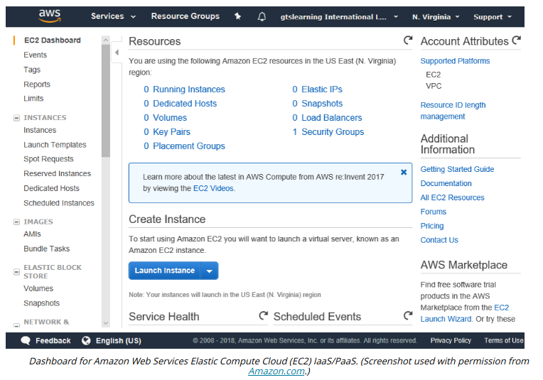

# CLOUD SERVICE MODELS

#### CLOUD SERVICE MODELS

As well as the ownership model (public, private, hybrid, or community), **cloud services** are often differentiated on the level of complexity and pre-configuration provided. These models are referred to as something or **anything as a service (XaaS)**. The three most common implementations are infrastructure, software, and platform.

**Infrastructure as a Service**  
**Infrastructure as a service (IaaS)** is a means of provisioning IT resources such as servers, load balancers, and storage area network (SAN) components quickly. Rather than purchase these components and the Internet links they require, you rent them on an as-needed basis from the service provider's data center. Examples include Amazon Elastic Compute Cloud (aws.amazon.com/ec2), Microsoft Azure Virtual Machines (azure.microsoft.com/services/virtual-machines), Oracle Cloud (oracle.com/cloud), and OpenStack (openstack.org).

**Software as a Service**  
**Software as a service (SaaS)** is a different model of provisioning software applications. Rather than purchasing software licenses for a given number of seats, a business would access software hosted on a supplier's servers on a pay-as-you-go or lease arrangement (on-demand). Virtual infrastructure allows developers to provision on-demand applications much more quickly than previously. The applications can be developed and tested in the cloud without the need to test and deploy on client computers. Examples include Microsoft Office 365 (microsoft.com/en-us/microsoft-365/enterprise), Salesforce (salesforce.com), and Google G Suite (gsuite.google.com).

**Platform as a Service**  
**Platform as a service (PaaS)** provides resources somewhere between SaaS and IaaS. A typical PaaS solution would provide servers and storage network infrastructure (as per IaaS) but also provide a multi-tier web application/database platform on top. This platform could be based on Oracle or MS SQL or PHP and MySQL. Examples include Oracle Database (oracle.com/database), Microsoft Azure SQL Database (azure.microsoft.com/services/sql-database), and Google App Engine (cloud.google.com/appengine).

As distinct from SaaS though, this platform would not be configured to actually do anything. Your own developers would have to create the software (the CRM or e‑commerce application) that runs using the platform. The service provider would be responsible for the integrity and availability of the platform components, but you would be responsible for the security of the application you created on the platform.

