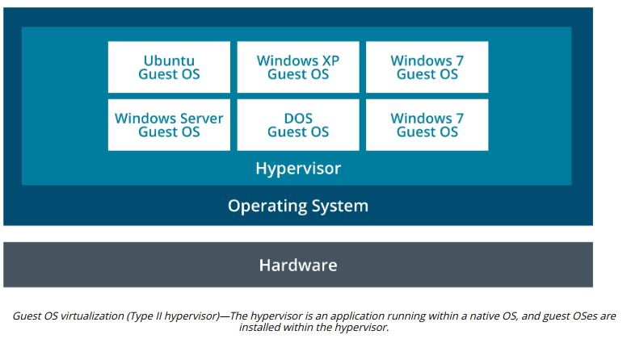
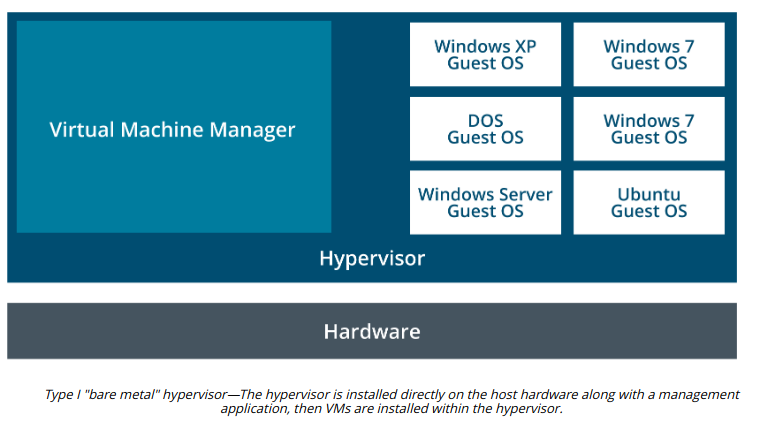

# VIRTUALIZATION TECHNOLOGIES AND HYPERVISOR TYPES

#### VIRTUALIZATION TECHNOLOGIES AND HYPERVISOR TYPES

**Virtualization** means that multiple operating systems can be installed and run simultaneously on a single computer. A virtual platform requires at least three components:

  
-   Host hardware—the platform that will host the virtual environment. Optionally, there may be multiple hosts networked together.
  
-   Hypervisor/Virtual Machine Monitor (VMM)—manages the virtual machine environment and facilitates interaction with the computer hardware and network.
  
-   Guest operating systems, **Virtual Machines (VM)**, or instances—operating systems installed under the virtual environment.
  

One basic distinction that can be made between virtual platforms is between host and bare metal methods of interacting with the host hardware. In a guest OS (or host-based) system, the hypervisor application (known as a Type II hypervisor) is itself installed onto a host operating system. Examples of host-based hypervisors include VMware Workstation, Oracle Virtual Box, and Parallels Workstation. The hypervisor software must support the host OS.

A bare metal virtual platform means that the hypervisor (Type I hypervisor) is installed directly onto the computer and manages access to the host hardware without going through a host OS. Examples include VMware ESXi Server, Microsoft's Hyper-V, and Citrix's XEN Server. The hardware needs only support the base system requirements for the hypervisor plus resources for the type and number of guest OSes that will be installed.

