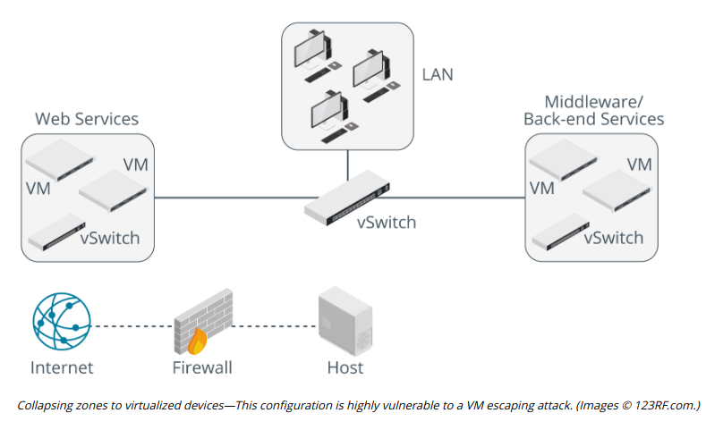
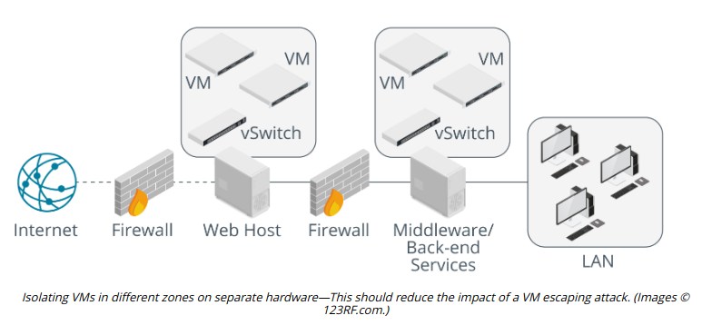

# VM ESCAPE PROTECTION

#### VM ESCAPE PROTECTION

**VM escaping** refers to malware running on a guest OS jumping to another guest or to the host. To do this, the malware must identify that it is running in a virtual environment, which is usually simple to do. One means of doing so is through a timing attack. The classic timing attack is to send multiple usernames to an authentication server and measure the server response times. An invalid username will usually be rejected very quickly, but a valid one will take longer (while the authentication server checks the password). This allows the attacker to harvest valid usernames. Malware can use a timing attack within a guest OS to detect whether it is running in a VM (certain operations may take a distinct amount of time compared to a "real" environment). There are numerous other "signatures" that an attacker could use to detect the presence of virtualized system hardware. The next step in VM escaping is for the attacker to compromise the hypervisor. Security researchers have been focusing on this type of exploit and several vulnerabilities have been found in popular hypervisors.

One serious implication of VM escaping is where virtualization is used for hosted applications. If you have a hosted web server, apart from trusting the hosting provider with your data, you have no idea what other applications might be running in other customers' VMs. For example, consider a scenario where you have an e-commerce web server installed on a virtual server leased from an ISP. If a third-party installs another guest OS with malware that can subvert the virtual server's hypervisor, they might be able to gain access to your server or to data held in the memory of the physical server. Having compromised the hypervisor, they could make a copy of your server image and download it to any location. This would allow the attacker to steal any unencrypted data held on the e-commerce server. Even worse, it could conceivably allow them to steal encrypted data, by obtaining the private encryption keys stored on the server or by sniffing unencrypted data or a data encryption key from the physical server's memory.

It is imperative to monitor security bulletins for the hypervisor software that you operate and to install patches and updates promptly. You should also design the VM architecture carefully so that the placement of VMs running different types of applications with different security requirements does not raise unnecessary risks.

Preventing VM escaping is dependent on the virtualization vendor identifying security vulnerabilities in the hypervisor and on these being patched. The impact of VM escaping can be reduced by using effective service design and network placement when deploying VMs.

For example, when considering security zones such as a DMZ, VMs providing front-end and middleware/back-end services should be separated to different physical hosts. This reduces the security implications of a VM escaping attack on a host in the DMZ (which will generally be more vulnerable to such attacks).

