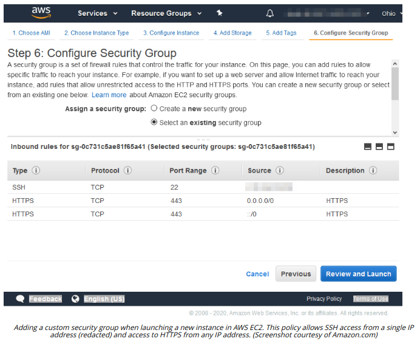

# SECURITY GROUPS

#### SECURITY GROUPS

In AWS, basic packet filtering rules managing traffic that each instance will accept can be managed through security groups (docs.aws.amazon.com/vpc/latest/userguide/VPC\_SecurityGroups.html). A security group provides stateful inbound and outbound filtering at layer 4. The stateful filtering property means that it will allow established and related traffic if a new connection has been accepted.

The default security group allows any outbound traffic and any inbound traffic from instances also bound to the default security group. A custom security group sets the ports and endpoints that are allowed for inbound and outbound traffic. There are no deny rules for security groups; any traffic that does not match an allow rule is dropped. Consequently, a custom group with no rules will drop all network traffic. Multiple instances can be assigned to the same security group, and instances within the same subnet can be assigned to different security groups. You can assign multiple security groups to the same instance. You can also assign security groups to VPC endpoint interfaces.

Most cloud providers support similar filtering functionality, though they may be implemented differently. For example, in Azure, network security groups can be applied to network interfaces or to subnets (docs.microsoft.com/en-us/azure/virtual-network/security-overview).