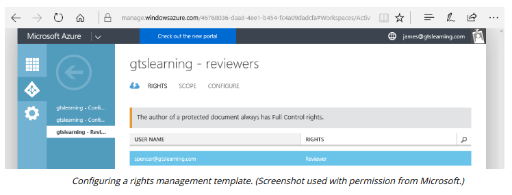

# RIGHTS MANAGEMENT SERVICES

#### RIGHTS MANAGEMENT SERVICES

As another example of data protection and information management solutions, Microsoft provides an Information Rights Management (IRM) feature in their Office productivity suite, SharePoint document collaboration services, and Exchange messaging server. IRM works with the Active Directory Rights Management Services (RMS) or the cloud-based Azure Information Protection. These technologies provide administrators with the following functionality:

  
-   Assign file permissions for different document roles, such as author, editor, or reviewer.
  
-   Restrict printing and forwarding of documents, even when sent as file attachments.
  
-   Restrict printing and forwarding of email messages.
  

Rights management is built into other secure document solutions, such as Adobe Acrobat.