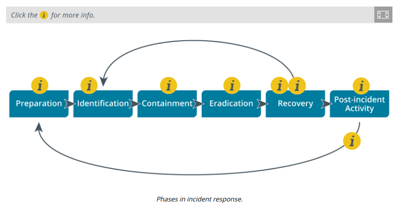

# INCIDENT RESPONSE PROCESS

#### INCIDENT RESPONSE PROCESS

Incident response policy sets the resources, processes, and guidelines for dealing with security incidents. Incident management is vital to mitigating risk. As well as controlling the immediate or specific threat to security, effective incident management preserves an organization's reputation.

Incident response follows a well-structured process, such as that set out in the NIST Computer Security Incident Handling Guide special publication (nvlpubs.nist.gov/nistpubs/SpecialPublications/NIST.SP.800-61r2.pdf). The following are the principal stages in an incident response life cycle:

1.  Preparation—make the system resilient to attack in the first place. This includes hardening systems, writing policies and procedures, and setting up confidential lines of communication. It also implies creating incident response resources and procedures.
  
3.  Identification—from the information in an alert or report, determine whether an incident has taken place, assess how severe it might be (triage), and notify stakeholders.
  
5.  Containment—limit the scope and magnitude of the incident. The principal aim of incident response is to secure data while limiting the immediate impact on customers and business partners.
  
7.  Eradication—once the incident is contained, remove the cause and restore the affected system to a secure state by applying secure configuration settings and installing patches.
  
9.  Recovery—with the cause of the incident eradicated, the system can be reintegrated into the business process that it supports. This recovery phase may involve restoration of data from backup and security testing. Systems must be monitored more closely for a period to detect and prevent any reoccurrence of the attack. The response process may have to iterate through multiple phases of identification, containment, eradication, and recovery to effect a complete resolution.
  
11.  Lessons learned—analyze the incident and responses to identify whether procedures or systems could be improved. It is imperative to document the incident. The outputs from this phase feed back into a new preparation phase in the cycle.
  

Incident response is likely to require coordinated action and authorization from several different departments or managers, which adds further levels of complexity.

