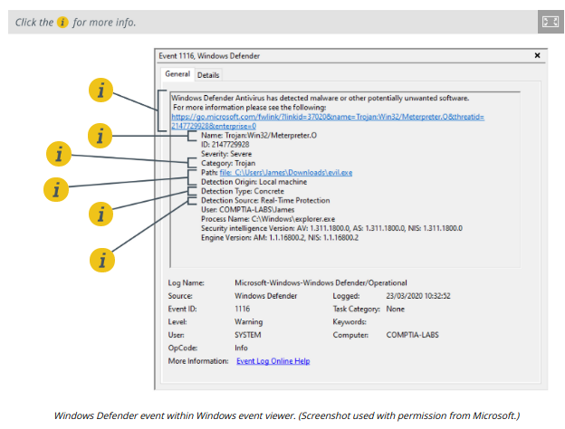
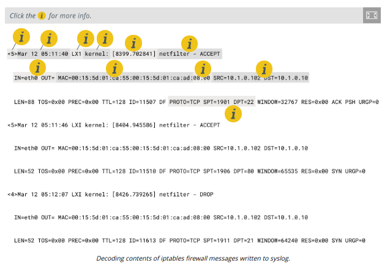

# NETWORK, OS, AND SECURITY LOG FILES

#### NETWORK, OS, AND SECURITY LOG FILES

Log file data is a critical resource for investigating security incidents. As well as the log format, you must also consider the range of sources for log files and know how to determine what type of log file will best support any given investigation scenario.

**System and Security Logs**  
One source of security information is the event log from each network server or client. Systems such as Microsoft Windows, Apple macOS, and Linux keep a variety of **logs** to record events as users and software interact with the system. The format of the logs varies depending on the system. Information contained within the logs also varies by system, and in many cases, the type of information that is captured can be configured.

When events are generated, they are placed into log categories. These categories describe the general nature of the events or what areas of the OS they affect. The five main categories of Windows event logs are:

-   Application—events generated by applications and services, such as when a service cannot start.
  
-   Security—Audit events, such as a failed logon or access to a file being denied. System—events generated by the operating system and its services, such as storage volume health checks.
  
-   Setup—events generated during the installation of Windows.
  
-   Forwarded Events—events that are sent to the local log from other hosts.
  

**Network Logs**  
Network logs are generated by appliances such as routers, firewalls, switches, and access points. Log files will record the operation and status of the appliance itself—the system log for the appliance—plus traffic and access logs recording network behavior, such as a host trying to use a port that is blocked by the firewall, or an endpoint trying to use multiple MAC addresses when connected to a switch.

**Authentication Logs**  
Authentication attempts for each host are likely to be written to the security log. You might also need to inspect logs from the servers authorizing logons, such as RADIUS and TACACS+ servers or Windows Active Directory (AD) servers.

**Vulnerability Scan Output**  
A vulnerability scan report is another important source when determining how an attack might have been made. The scan engine might log or alert when a scan report contains vulnerabilities. The report can be analyzed to identify vulnerabilities that have not been patched or configuration weaknesses that have not been remediated. These can be correlated to recently developed exploits.

