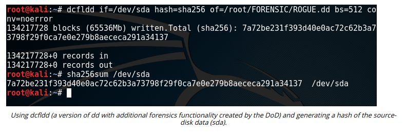

# DISK IMAGE ACQUISITION

#### DISK IMAGE ACQUISITION

Disk image acquisition refers to acquiring data from nonvolatile storage. Nonvolatile storage includes hard disk drives (HDDs), solid state drives (SSDs), firmware, other types of flash memory (USB thumb drives and memory cards), and optical media (CD, DVD, and Blu-Ray). This can also be referred to as device acquisition, meaning the SSD storage in a smartphone or media player. Disk acquisition will also capture the OS installation, if the boot volume is included.

There are three device states for persistent storage acquisition:

-   Live acquisition—this means copying the data while the host is still running. This may capture more evidence or more data for analysis and reduce the impact on overall services, but the data on the actual disks will have changed, so this method may not produce legally acceptable evidence. It may also alert the adversary and allow time for them to perform anti-forensics.
  
-   Static acquisition by shutting down the host—this runs the risk that the malware will detect the shutdown process and perform anti-forensics to try to remove traces of itself. Static acquisition by pulling the plug—this means disconnecting the power at the wall socket (not the hardware power-off button). This is most likely to preserve the storage devices in a forensically clean state, but there is the risk of corrupting data.
  
-   Given sufficient time at the scene, you may decide to perform both a live and static acquisition. Whichever method is used, it is imperative to document the steps taken and supply a timeline for your actions.

  

There are many GUI imaging utilities, including those packaged with suites such as the Forensic Toolkit and its FTK Imager. You should note that the EnCase forensics suite uses a vendor file format (.e01) compared to the raw file format used by Linux tools like `dd`. The file format is important when it comes to selecting a tool for analyzing the image. The .eo1 format allows image metadata (such as the checksum, drive geometry, and acquisition time) to be stored within the same file. The open-source Advanced Forensic Format (AFF) provides similar features.

If no specialist tool is available, on a Linux host you can use the **dd command** to make a copy of an input file (`if=`) to an output file (`of=`) and apply optional conversions to the file data. In the following sda is the fixed drive:

`dd if=/dev/sda of=/mnt/usbstick/backup.img` 

A more recent fork of `dd` is `dcfldd`, which provides additional features like multiple output files and exact match verification.

