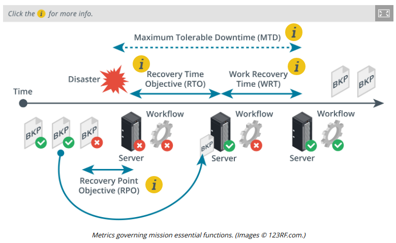

# MISSION ESSENTIAL FUNCTIONS

#### MISSION ESSENTIAL FUNCTIONS

A **mission essential function (MEF)** is one that cannot be deferred. This means that the organization must be able to perform the function as close to continually as possible, and if there is any service disruption, the mission essential functions must be restored first.

> _Functions that act as support for the business or an MEF but are not critical in themselves are referred to as primary business functions (PBF)._

Analysis of mission essential functions is generally governed by four main metrics:

-   **Maximum tolerable downtime (MTD)** is the longest period of time that a business function outage may occur for without causing irrecoverable business failure. Each business process can have its own MTD, such as a range of minutes to hours for critical functions, 24 hours for urgent functions, seven days for normal functions, and so on. MTDs vary by company and event. Each function may be supported by multiple systems and assets. The MTD sets the upper limit on the amount of recovery time that system and asset owners have to resume operations. For example, an organization specializing in medical equipment may be able to exist without incoming manufacturing supplies for three months because it has stockpiled a sizable inventory. After three months, the organization will not have sufficient supplies and may not be able to manufacture additional products, therefore leading to failure. In this case, the MTD is three months.

-   **Recovery time objective (RTO)** is the period following a disaster that an individual IT system may remain offline. This represents the amount of time it takes to identify that there is a problem and then perform recovery (restore from backup or switch in an alternative system, for instance).
-   **Work Recovery Time (WRT)**. Following systems recovery, there may be additional work to reintegrate different systems, test overall functionality, and brief system users on any changes or different working practices so that the business function is again fully supported.

> _RTO+WRT must not exceed MTD!_

-   **Recovery Point Objective (RPO)** is the amount of data loss that a system can sustain, measured in time. That is, if a database is destroyed by a virus, an RPO of 24 hours means that the data can be recovered (from a backup copy) to a point not more than 24 hours before the database was infected.

For example, a customer leads database might be able to sustain the loss of a few hours' or days' worth of data (the salespeople will generally be able to remember who they have contacted and rekey the data manually). Conversely, order processing may be considered more critical, as any loss will represent lost orders and it may be impossible to recapture web orders or other processes initiated only through the computer system, such as linked records to accounting and fulfillment.

MTD and RPO help to determine which business functions are critical and also to specify appropriate risk countermeasures. For example, if your RPO is measured in days, then a simple tape backup system should suffice; if RPO is zero or measured in minutes or seconds, a more expensive server cluster backup and redundancy solution will be required.