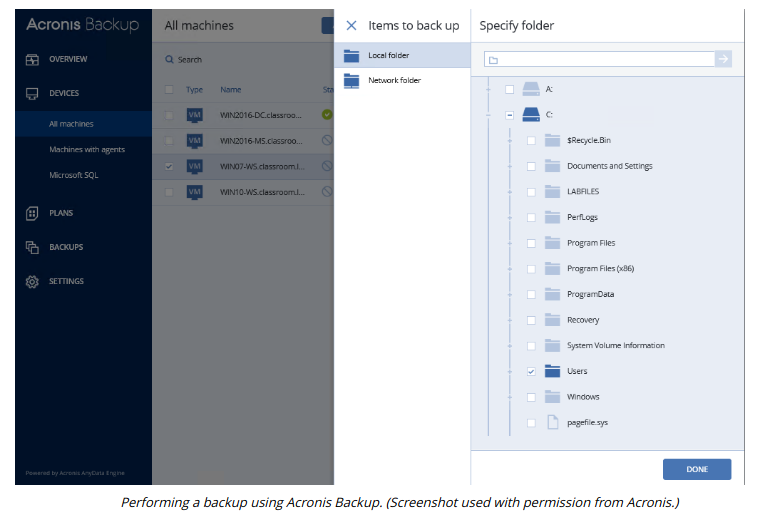
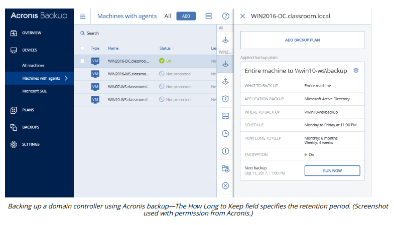

# BACKUPS AND RETENTION POLICY

#### BACKUPS AND RETENTION POLICY

Every business continuity and disaster recovery plan makes use of **backups**, of one type or another. The execution and frequency of backups must be carefully planned and guided by policies. Data retention needs to be considered in the short and long term:

-   In the short term, files that change frequently might need retaining for version control. Short-term retention is also important in recovering from malware infection. Consider the scenario where a backup is made on Monday, a file is infected with a virus on Tuesday, and when that file is backed up later on Tuesday, the copy made on Monday is overwritten. This means that there is no good means of restoring the uninfected version of the file. Short-term retention is determined by how often the youngest media sets are overwritten.

-   In the long term, data may need to be stored to meet legal requirements or to comply with company policies or industry standards. Any data that must be retained in a particular version past the oldest sets should be moved to archive storage.

For these reasons, backups are kept back to certain points in time. As backups take up a lot of space, and there is never limitless storage capacity, this introduces the need for storage management routines to reduce the amount of data occupying backup storage media while giving adequate coverage of the required recovery window. The recovery window is determined by the recovery point objective (RPO), which is determined through business continuity planning. Advanced backup software can prevent media sets from being overwritten in line with the specified retention policy.

