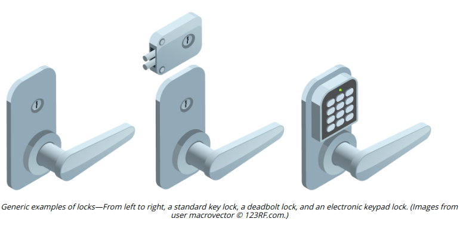
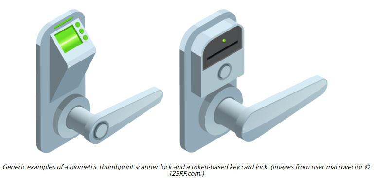

# GATEWAYS AND LOCKS

#### GATEWAYS AND LOCKS

In order to secure a gateway, it must be fitted with a lock. A secure gateway will normally be self-closing and self-locking, rather than depending on the user to close and lock it. Lock types can be categorized as follows:

-   Physical—a conventional lock prevents the door handle from being operated without the use of a key. More expensive types offer greater resistance against lock picking.
-   Electronic—rather than a key, the lock is operated by entering a PIN on an electronic keypad. This type of lock is also referred to as cipher, combination, or keyless. A smart lock may be opened using a magnetic swipe card or feature a **proximity reader** to detect the presence of a physical token, such as a wireless key fob or smart card.

-   Biometric—a lock may be integrated with a biometric scanner.

**_Mantraps_**  
Apart from being vulnerable to lock picking, the main problem with a simple door or gate as an entry mechanism is that it cannot accurately record who has entered or left an area. Multiple people may pass through the gateway at the same time; a user may hold a door open for the next person; an unauthorized user may "tailgate" behind an authorized user. This risk may be mitigated by installing a **turnstile** (a type of gateway that only allows one person through at a time). The other option is to add some sort of surveillance on the gateway. Where security is critical and cost is no object, an access control vestibule, or mantrap, could be employed. A **mantrap** is where one gateway leads to an enclosed space protected by another barrier.

**_Cable Locks_**  
**Cable locks** attach to a secure point on the device chassis. A server chassis might come with both a metal loop and a Kensington security slot. As well as securing the chassis to a rack or desk, the position of the secure point prevents the chassis from being opened, without removing the cable first.