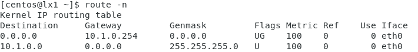

# route and traceroute

ROUTE AND TRACEROUTE

The following tools can be used to test the routing configuration and connectivity with remote hosts and networks.

-   **route**—view and configure the host's local routing table. Most end systems use a default route to forward all traffic for remote networks via a gateway router. If the host is not a router, additional entries in the routing table could be suspicious.

_Output from the route command on a Linux host. Most endpoints have a simple routing table, similar to this. It shows the default route (0.0.0.0/0) via the host configured as the default gateway (10.1.0.254) over the network interface eth0. The second line of the table shows the subnet for local traffic (10.1.0.0/24). This network is directly connected, represented by the 0.0.0.0 gateway._

-   **tracert**—uses ICMP probes to report the round trip time (RTT) for hops between the local host and a host on a remote network. `tracert` is the Windows version of the tool.
-   **traceroute**—performs route discovery from a Linux host. `traceroute` uses UDP probes rather than ICMP, by default.
-   **pathping**—provides statistics for latency and packet loss along a route over a longer measuring period. `pathping` is a Windows tool; the equivalent on Linux is **mtr.**

In a security context, high latency at the default gateway compared to a baseline might indicate a man-in-the-middle attack. High latency on other hops could be a sign of denial of service, or could just indicate network congestion.

> _In Linux, commands such as ifconfig, arp, route, and traceroute are deprecated and the utilities have not been updated for some years. The iproute2 suite of tools supply replacements for these commands ([digitalocean.com/community/tutorials/how-to-use-iproute2-tools-to-manage-network-configuration-on-a-linux-vps](https://course.adinusa.id/sections/route-and-traceroute))._