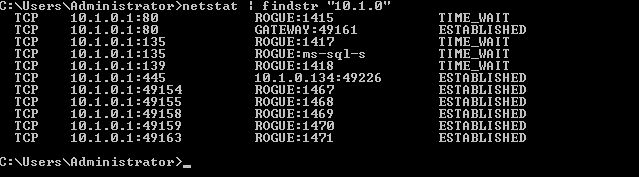
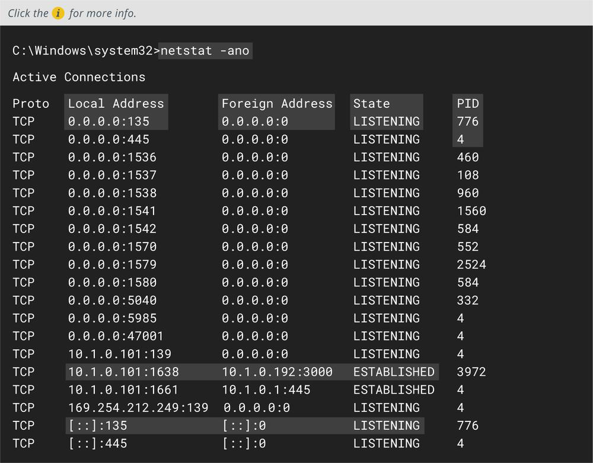
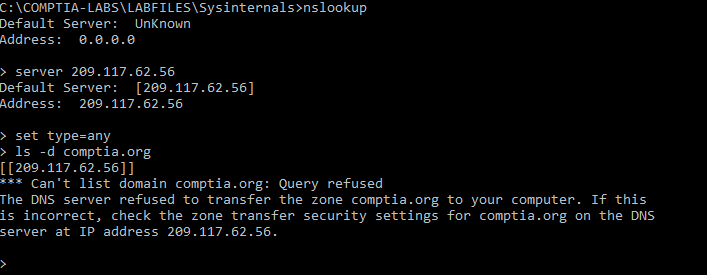

# netstat and nslookup

NETSTAT AND NSLOOKUP

Basic service discovery tasks can also be performed using tools built into the Windows and Linux operating systems:

-   **netstat**—show the state of TCP/UDP ports on the local machine. The same command is used on both Windows and Linux, though with different options syntax. You can use `netstat` to check for service misconfigurations (perhaps a host is running a web or FTP server that a user installed without authorization). You may also be able to identify suspect remote connections to services on the local host or from the host to remote IP addresses. If you are attempting to identify malware, the most useful `netstat` output is to show which process is listening on which ports.

_netstat command running on Windows showing activity during an nmap scan. The findstr function is being used to filter the output (to show only connections from IPv4 hosts on the same subnet). (Screenshot used with permission from Microsoft.)_

_Command line output from netstat –ano._

> _On Linux, use of netstat is deprecated in favor of the ss command from the iptools2 suite ([linux.com/topic/networking/introduction-ss-command](https://course.adinusa.id/sections/netstat-and-nslookup))._

-   **nslookup/dig**—query name records for a given domain using a particular DNS resolver under Windows (`nslookup`) or Linux (`dig`). An attacker may test a network to find out if the DNS service is misconfigured. A misconfigured DNS may allow a zone transfer, which will give the attacker the complete records of every host in the domain, revealing a huge amount about the way the network is configured.

_Testing whether the name server for comptia.org will allow a zone transfer. (Screenshot used with permission from Microsoft.)_