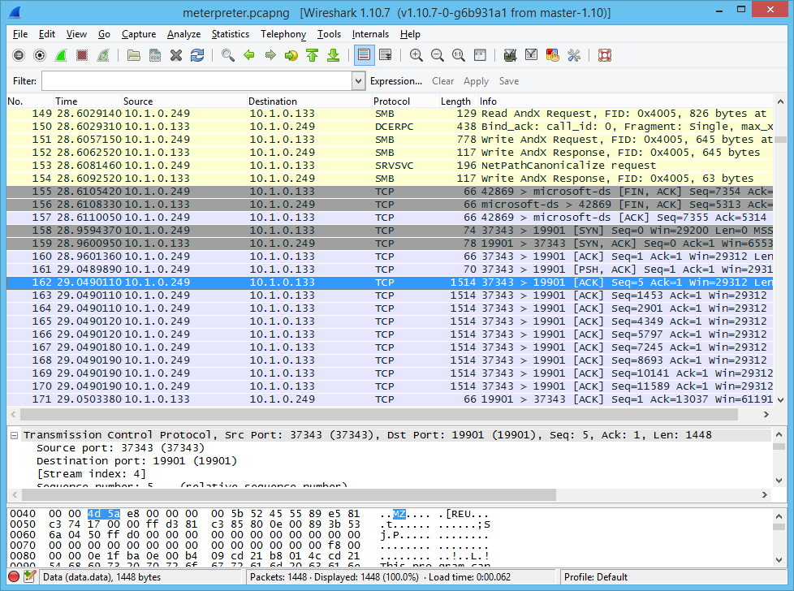
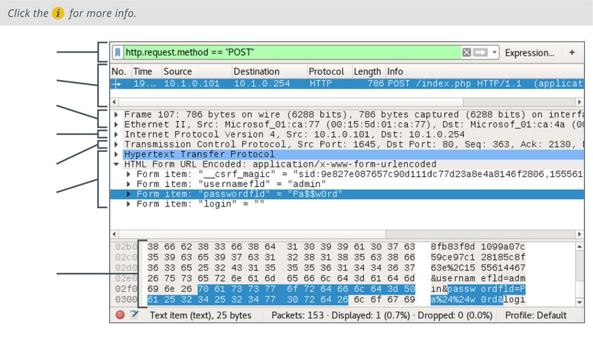

# Packet Analysis and Wireshark

PACKET ANALYSIS AND WIRESHARK

A protocol analyzer (or packet analyzer) works in conjunction with a sniffer to perform **traffic analysis**. You can either analyze a live capture or open a saved capture (**.pcap**) file. Protocol analyzers can decode a captured frame to reveal its contents in a readable format. You can choose to view a summary of the frame or choose a more detailed view that provides information on the OSI layer, protocol, function, and data.

**Wireshark** ([wireshark.org](https://course.adinusa.id/sections/packet-analysis-and-wireshark)) is an open-source graphical packet capture and analysis utility, with installer packages for most operating systems. Having chosen the interface to listen on, the output is displayed in a three-pane view. The packet list pane shows a scrolling summary of frames. The packet details pane shows expandable fields in the frame currently selected from the packet list. The packet bytes pane shows the raw data from the frame in hex and ASCII. Wireshark is capable of parsing (interpreting) the headers and payloads of hundreds of network protocols.

You can apply a capture filter using the same expression syntax as `tcpdump` (though the expression can be built via the GUI tools too). You can save the output to a .pcap file or load a file for analysis. Wireshark supports very powerful display filters ([wiki.wireshark.org/DisplayFilters](https://course.adinusa.id/sections/packet-analysis-and-wireshark)) that can be applied to a live capture or to a capture file. You can also adjust the coloring rules ([wiki.wireshark.org/ColoringRules](https://course.adinusa.id/sections/packet-analysis-and-wireshark)), which control the row shading and font color for each frame.

_Wireshark protocol analyzer. (Screenshot used with permission from wireshark.org.)_

_Wireshark output of a packet analysis. (Screenshot used with permission from wireshark.org.)_

Another useful option is to use the **Follow TCP Stream** context command to reconstruct the packet contents for a TCP session.

> _The PCAP file format has some limitations, which has led to the development of PCAP Next Generation (PCAPNG). Wireshark now uses PCAPNG by default, and tcpdump can process files in the new format too ([cloudshark.io/articles/5-reasons-to-move-to-pcapng](https://course.adinusa.id/sections/packet-analysis-and-wireshark))._