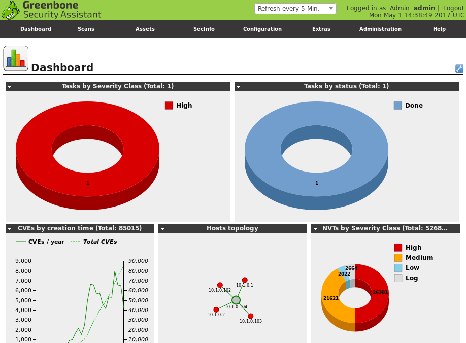

# Vulnerability Scan Types

#### VULNERABILITY SCAN TYPES

An automated scanner must be configured with signatures and scripts that can correlate known software and configuration vulnerabilities with data gathered from each host. Consequently, there are several types of vulnerability scanners optimized for different tasks.

**Network Vulnerability Scanner**  
A network **vulnerability scanner**, such as Tenable Nessus ([tenable.com/products/nessus](https://course.adinusa.id/sections/vulnerability-scan-types)) or OpenVAS ([openvas.org](https://course.adinusa.id/sections/vulnerability-scan-types)), is designed to test network hosts, including client PCs, mobile devices, servers, routers, and switches. It examines an organization's on-premises systems, applications, and devices and compares the scan results to configuration templates plus lists of known vulnerabilities. Typical results from a vulnerability assessment will identify missing patches, deviations from baseline configuration templates, and other related vulnerabilities.

_Greenbone OpenVAS vulnerability scanner with Security Assistant web application interface as installed on Kali Linux. (Screenshot used with permission from Greenbone Networks, [http://www.openvas.org.](https://course.adinusa.id/sections/vulnerability-scan-types))_

The first phase of scanning might be to run a detection scan to discover hosts on a particular IP subnet. In the next phase of scanning, a target range of hosts is probed to detect running services, patch level, security configuration and policies, network shares, unused accounts, weak passwords, antivirus configuration, and so on.

Each scanner is configured with a database of known software and configuration vulnerabilities. The tool compiles a report about each vulnerability in its database that was found to be present on each host. Each identified vulnerability is categorized and assigned an impact warning. Most tools also suggest remediation techniques. This information is highly sensitive, so use of these tools and the distribution of the reports produced should be restricted to authorized hosts and user accounts.

Network vulnerability scanners are configured with information about known vulnerabilities and configuration weaknesses for typical network hosts. These scanners will be able to test common operating systems, desktop applications, and some server applications. This is useful for general purpose scanning, but some types of applications might need more rigorous analysis.

**Application and Web Application Scanners**  
A dedicated application scanner is configured with more detailed and specific scripts to test for known attacks, as well as scanning for missing patches and weak configurations. The best known class of application scanners are web application scanners. Tools such as Nikto ([cirt.net/Nikto2](https://course.adinusa.id/sections/vulnerability-scan-types)) look for known web exploits, such as SQL injection and cross-site scripting (XSS), and may also analyze source code and database security to detect unsecure programming practices. Other types of application scanner would be optimized for a particular class of software, such as a database server.