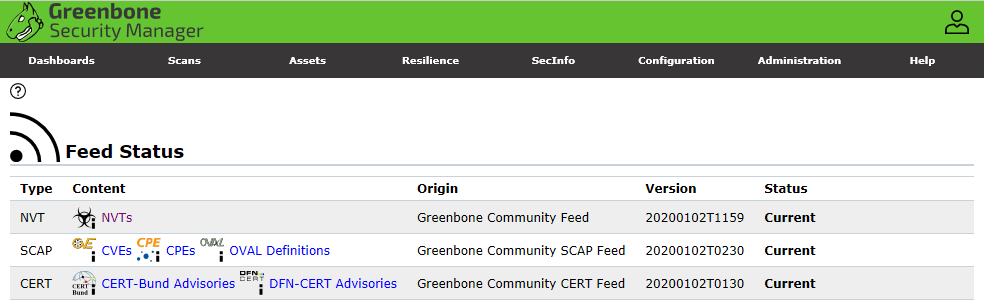
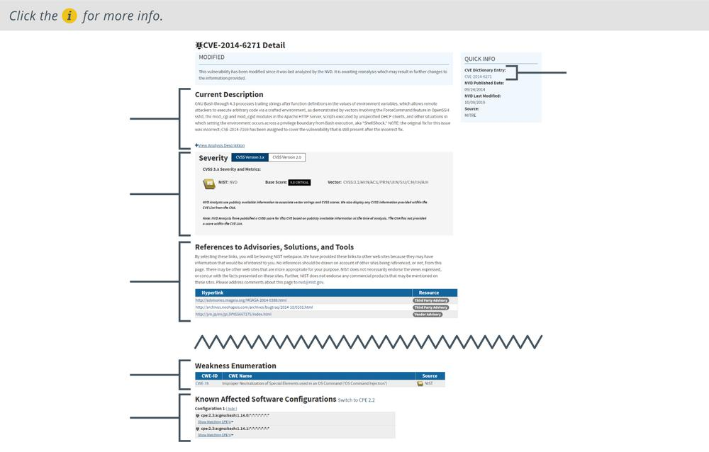

# Common Vulnerabilities and Exposures

#### COMMON VULNERABILITIES AND EXPOSURES

An automated scanner needs to be kept up to date with information about known vulnerabilities. This information is often described as a **vulnerability feed**, though the Nessus tool refers to these feeds as _plug-ins_, and OpenVAS refers to them as _network vulnerability tests (NVTs)_. Often, the vulnerability feed forms an important part of scan vendors' commercial models, as the latest updates require a valid subscription to acquire.

_Checking feed status in the Greenbone Community Edition vulnerability manager. (Screenshot: Greenbone Community Edition [greenbone.net/en/community-edition](https://course.adinusa.id/sections/common-vulnerabilities-and-exposures).)_

Vulnerability feeds make use of common identifiers to facilitate sharing of intelligence data across different platforms. Many vulnerability scanners use the **Secure Content Automation Protocol (SCAP)** to obtain feed or plug-in updates ([scap.nist.gov](https://course.adinusa.id/sections/common-vulnerabilities-and-exposures)). As well as providing a mechanism for distributing the feed, SCAP defines ways to compare the actual configuration of a system to a target-secure baseline plus various systems of common identifiers. These identifiers supply a standard means for different products to refer to a vulnerability or platform consistently.

**Common Vulnerabilities and Exposures (CVE)** is a dictionary of vulnerabilities in published operating systems and applications software ([cve.mitre.org](https://course.adinusa.id/sections/common-vulnerabilities-and-exposures)). There are several elements that make up a vulnerability's entry in the CVE:

-   An identifier in the format: CVE-YYYY-####, where YYYY is the year the vulnerability was discovered, and #### is at least four digits that indicate the order in which the vulnerability was discovered.
    
-   A brief description of the vulnerability.
    
-   A reference list of URLs that supply more information on the vulnerability.
    
-   The date the vulnerability entry was created.
    

The CVE dictionary provides the principal input for NIST's National Vulnerability Database ([nvd.nist.gov](https://course.adinusa.id/sections/common-vulnerabilities-and-exposures)). The NVD supplements the CVE descriptions with additional analysis, a criticality metric, calculated using the **Common Vulnerability Scoring System (CVSS)**, plus fix information.

CVSS is maintained by the Forum of Incident Response and Security Teams ([first.org/cvss](https://course.adinusa.id/sections/common-vulnerabilities-and-exposures)). CVSS metrics generate a score from 0 to 10 based on characteristics of the vulnerability, such as whether it can be triggered remotely or needs local access, whether user intervention is required, and so on. The scores are banded into descriptions too:

Score | Description
----- | -----
0.1+ | Low
4.0+ | Medium
7.0+ | High
9.0+ | Critical

_An excerpt from an entry in the National Vulnerability Database._