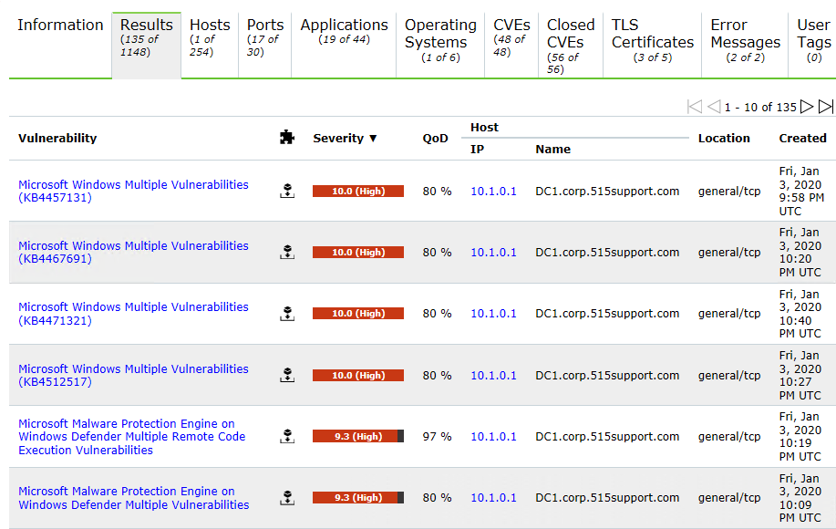

# False Positives, False Negatives, and Log Review

#### FALSE POSITIVES, FALSE NEGATIVES, AND LOG REVIEW

A scanning tool will generate a summary report of all vulnerabilities discovered during the scan directly after execution completes. These reports color-code vulnerabilities in terms of their criticality, with red typically denoting a weakness that requires immediate attention. You can usually view vulnerabilities by scope (most critical across all hosts) or by host. The report should include or link to specific details about each vulnerability and how hosts can be remediated.

_Scan report listing multiple high-severity vulnerabilities found in a Windows host. (Screenshot: Greenbone Community Edition [greenbone.net/en/community-edition](https://course.adinusa.id/sections/false-positives-false-negatives-and-log-review).)_

Intrusive/active scanning is more likely to detect a wider range of vulnerabilities in host systems and can reduce false positives. A _false positive_ is something that is identified by a scanner or other assessment tool as being a vulnerability, when in fact it is not. For example, assume that a vulnerability scan identifies an open port on the firewall. Because a certain brand of malware has been known to use this port, the tool labels this as a security risk, and recommends that you close the port. However, the port is not open on your system. Researching the issue costs time and effort, and if excessive false positives are thrown by a vulnerability scan, it is easy to disregard the scans entirely, which could lead to larger problems.

You should also be alert to the possibility of _false negatives_—that is, potential vulnerabilities that are not identified in a scan. This risk can be mitigated somewhat by running repeat scans periodically and by using scanners from more than one vendor. Also, because automated scan plug-ins depend on pre-compiled scripts, they do not reproduce the success that a skilled and determined hacker might be capable of and can therefore create a false sense of security.

Reviewing related system and network logs can enhance the vulnerability report validation process. As an example, assume that your vulnerability scanner identified a running process on a Windows machine. According to the scanner, the application that creates this process is known to be unstable, causing the operating system to lock up and crash other processes and services. When you search the computer's event logs, you notice several entries over the past couple of weeks indicate the process has failed. Additional entries show that a few other processes fail right after. In this instance, you've used a relevant data source to help confirm that the vulnerability alert is, in fact, valid.