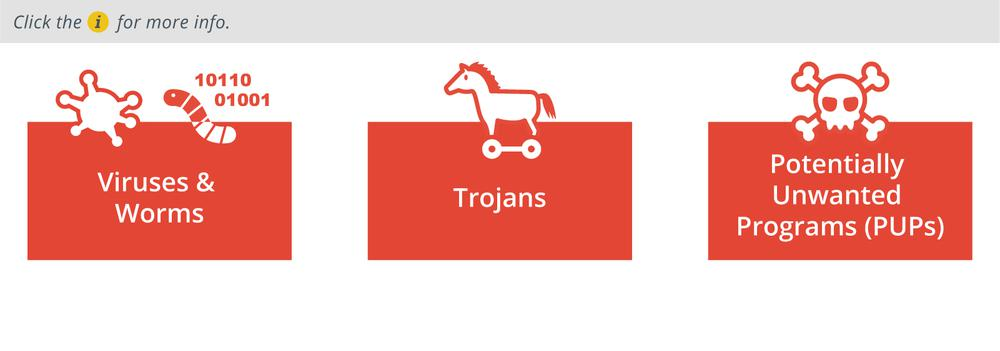

# Malware Classification

#### MALWARE CLASSIFICATION

Many of the intrusion attempts perpetrated against computer networks depend on the use of malicious software, or malware. _Malware_ is usually simply defined as software that does something bad, from the perspective of the system owner. There are many types of malware, but they are not classified in a rigorous way, so some definitions overlap or are blurred. Some malware classifications, such as Trojan, virus, and worm, focus on the vector used by the malware. The vector is the method by which the malware executes on a computer and potentially spreads to other network hosts. Another complicating factor with malware classification is the degree to which its installation is expected or tolerated by the user. The following categories describe some types of malware according to vector:

-   Viruses and worms—these represent some of the first types of malware and spread without any authorization from the user by being concealed within the executable code of another process.
    
-   **Trojan**—malware concealed within an installer package for software that appears to be legitimate. This type of malware does not seek any type of consent for installation and is actively designed to operate secretly.
    
-   **Potentially unwanted programs (PUPs)**/Potentially unwanted applications (PUAs)—software installed alongside a package selected by the user or perhaps bundled with a new computer system. Unlike a Trojan, the presence of a PUP is not automatically regarded as malicious. It may have been installed without active consent or consent from a purposefully confusing license agreement. This type of software is sometimes described as _grayware_ rather than malware.
    

Other classifications are based on the payload delivered by the malware. The _payload_ is an action performed by the malware other than simply replicating or persisting on a host. Examples of payload classifications include spyware, rootkit, remote access Trojan (RAT), and ransomware.

