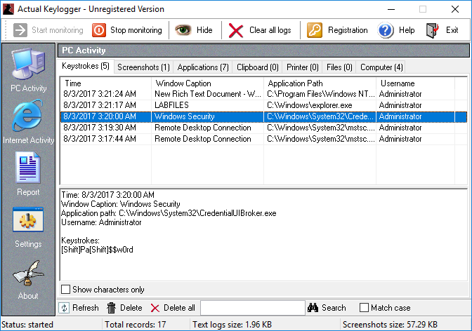

# Spyware and Keyloggers

#### SPYWARE AND KEYLOGGERS

The first viruses and worms focused on the destructive potential of being able to replicate. As the profitable uses of this software became apparent, however, they started to be coded with payloads designed to facilitate intrusion, fraud, and data theft. Various types of unwanted code and malware perform some level of monitoring:

-   Tracking **cookies**—cookies are plaintext files, not malware, but if browser settings allow third-party cookies, they can be used to record pages visited, search queries, browser metadata, and IP address. Tracking cookies are created by adverts and analytics widgets embedded into many websites.
    
-   **Adware**—this is a class of PUP/grayware that performs browser reconfigurations, such as allowing tracking cookies, changing default search providers, opening sponsor's pages at startup, adding bookmarks, and so on. Adware may be installed as a program or as a browser extension/plug-in.
    
-   **Spyware**—this is malware that can perform adware-like tracking, but also monitor local application activity, take screenshots, and activate recording devices, such as a microphone or webcam. Another spyware technique is to perform DNS redirection to pharming sites.
    
-   A **keylogger** is spyware that actively attempts to steal confidential information by recording keystrokes. The attacker will usually hope to discover passwords or credit card data.

_Actual Keylogger is Windows software that can run in the background to monitor different kinds of computer activity (opening and closing programs, browsing websites, recording keystrokes, and capturing screenshots). (Screenshot used with permission from [ActualKeylogger.com.](https://course.adinusa.id/sections/spyware-and-keyloggers))_

> _Keyloggers are not only implemented as software. A malicious script can transmit key presses to a third-party website. There are also hardware devices to capture key presses to a modified USB adapter inserted between the keyboard and the port. Such devices can store data locally or come with Wi-Fi connectivity to send data to a covert access point. Other attacks include wireless sniffers to record key press data, overlay ATM pin pads, and so on._