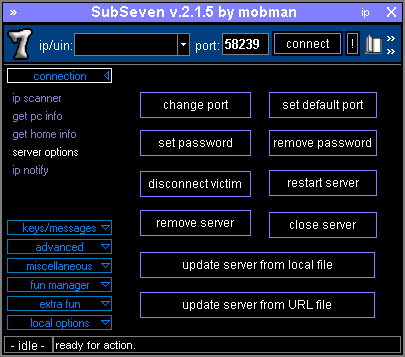

# Backdoors and Remote Access Trojans

#### BACKDOORS AND REMOTE ACCESS TROJANS

Any type of access method to a host that circumvents the usual authentication method and gives the remote user administrative control can be referred to as a **backdoor**. A **remote access trojan (RAT)** is backdoor malware that mimics the functionality of legitimate remote control programs, but is designed specifically to operate covertly. Once the RAT is installed, it allows the threat actor to access the host, upload files, and install software or use "live off the land" techniques to effect further compromises.

> _In this context, RAT can also stand for Remote Administration Tool. A host that is under malicious control is sometimes described as a zombie._

A compromised host can be installed with one or more bots. A bot is an automated script or tool that performs some malicious activity. A group of bots that are all under the control of the same malware instance can be manipulated as a **botnet** by the herder program. A botnet can be used for many types of malicious purpose, including triggering distributed denial of service (DDoS) attacks, launching spam campaigns, or performing cryptomining.

_SubSeven RAT. (Screenshot used with permission from Wikimedia Commons by CCAS4.0 International.)_

Whether a backdoor is used as a standalone intrusion mechanism or to manage bots, the threat actor must establish a connection from the compromised host to a **command and control (C2 or C&C)** host or network. This network connection is usually the best way to identify the presence of a RAT, backdoor, or bot. There are many means of implementing a C&C network as a **covert channel** to evade detection and filtering. Historically, the **Internet relay chat (IRC)** protocol was popular. Modern methods are more likely to use command sequences embedded in HTTPS or DNS traffic.

> _Backdoors can be created in other ways than infection by malware. Programmers may create backdoors in software applications for testing and development that are subsequently not removed when the application is deployed. Backdoors are also created by misconfiguration of software or hardware that allows access to unauthorized users. Examples include leaving a router configured with the default administrative password, having a Remote Desktop connection configured with an unsecure password, or leaving a modem open to receive dial-up connections._