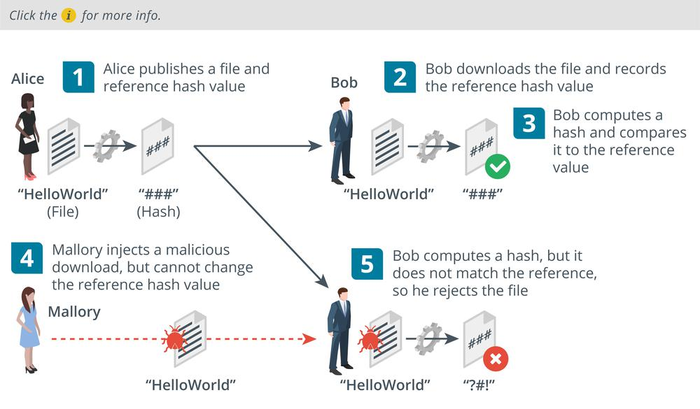
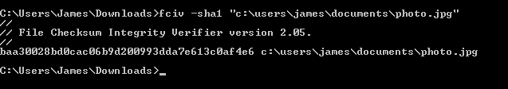

# Hashing Algorithms

#### HASHING ALGORITHMS

**Hashing** is the simplest type of cryptographic operation. A cryptographic hashing algorithm produces a fixed length string from an input plaintext that can be of any length. The output can be referred to as a **checksum**, message digest, or hash. The function is designed so that it is impossible to recover the plaintext data from the digest (one-way) and so that different inputs are unlikely to produce the same output (a collision).

A hashing algorithm is used to prove integrity. For example, Bob and Alice can compare the values used for a password in the following way:

1.  Bob already has a digest calculated from Alice's plaintext password. Bob cannot recover the plaintext password value from the hash.
2.  When Alice needs to authenticate to Bob, she types her password, converts it to a hash, and sends the digest to Bob.
3.  Bob compares Alice's digest to the hash value he has on file. If they match, he can be sure that Alice typed the same password.

As well as comparing password values, a hash of a file can be used to verify the integrity of that file after transfer.

1.  Alice runs a hash function on the setup.exe file for her product. She publishes the digest to her website with a download link for the file.
2.  Bob downloads the setup.exe file and makes a copy of the digest.
3.  Bob runs the same hash function on the downloaded setup.exe file and compares it to the reference value published by Alice. If it matches the value published on the website, the integrity of the file can be assumed.
4.  Consider that Mallory might be able to substitute the download file for a malicious file. Mallory cannot change the reference hash, however.
5.  This time, Bob computes a hash but it does not match, leading him to suspect that the file has been tampered with.

_Confirming a file download using cryptographic hashes. (Images © 123RF.com.)_

There are two popular implementations hash algorithms:

-   **Secure Hash Algorithm (SHA)**—considered the strongest algorithm. There are variants that produce different-sized outputs, with longer digests considered more secure. The most popular variant is SHA-256, which produces a 256-bit digest.
    
-   **Message Digest Algorithm #5 (MD5)**—produces a 128-bit digest. MD5 is not considered to be quite as safe for use as SHA-256, but it might be required for compatibility between security products.

_Computing an SHA value from a file. (Screenshot used with permission from Microsoft.)_