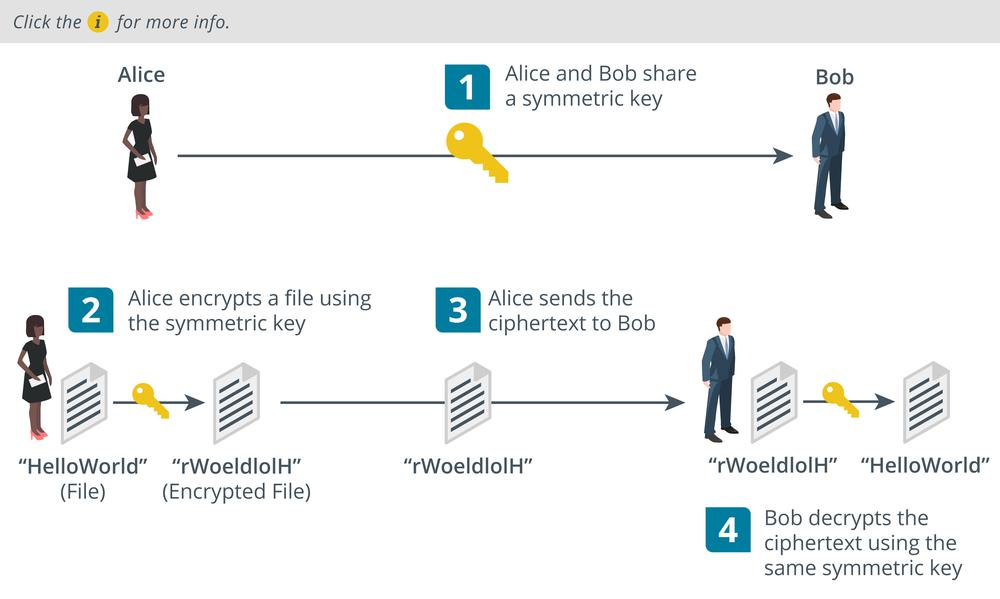

# Symmetric Encryption

#### SYMMETRIC ENCRYPTION

A symmetric cipher is one in which encryption and decryption are both performed by the same secret key. The secret key is so-called because it must be kept secret. If the key is lost or stolen, the security is breached. **Symmetric encryption** is used for confidentiality. For example, Alice and Bob can share a confidential file in the following way:

1.  Alice and Bob meet to agree which cipher to use and a secret key value. They both record the value of the secret key, making sure that no one else can discover it.
    
2.  Alice encrypts a file using the cipher and key.
    
3.  She sends only the ciphertext to Bob over the network.
    
4.  Bob receives the ciphertext and is able to decrypt it by applying the same cipher with his copy of the secret key.

_Symmetric encryption operation and weaknesses. (Images © 123RF.com.)_

> _Symmetric encryption is also referred to as single key or private key or shared secret. Note that "private key" is also used to refer to part of the public key cryptography process, so take care not to confuse the two uses._

Symmetric encryption is very fast. It is used for bulk encryption of large amounts of data. The main problem is secure distribution and storage of the key, or the exact means by which Alice and Bob "meet" to agree on the key. If Mallory intercepts the key and obtains the ciphertext, the security is broken.

Note that symmetric encryption cannot be used for authentication or integrity, because Alice and Bob are able to create exactly the same secrets, because they both know the same key.