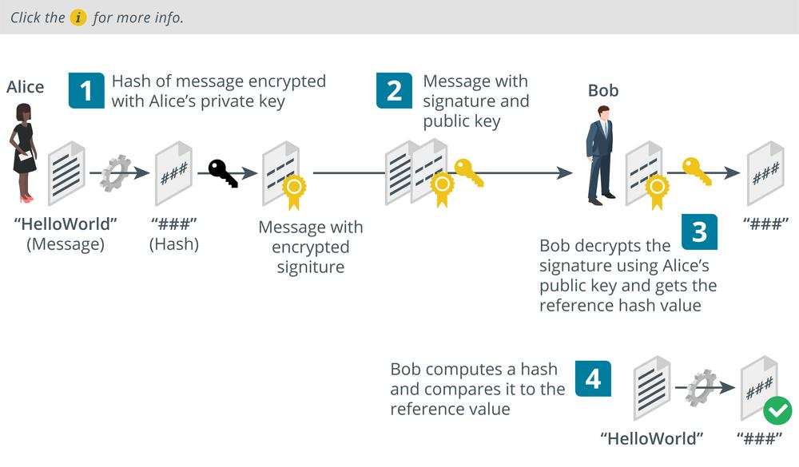

# Digital Signatures

#### DIGITAL SIGNATURES

Public key cryptography can authenticate a sender, because they control a private key that encrypts messages in a way that no one else can. Public key cryptography can only be used with very small messages, however. Hashing proves integrity by computing a unique checksum from input. These two cryptographic functions can be combined to authenticate a sender and prove the integrity of a message. This usage is called a digital signature. The following process is used to create a **digital signature** using RSA encryption:

1.  The sender (Alice) creates a digest of a message, using a pre-agreed hash algorithm, such as SHA256, and then encrypts the digest using her private key.
    
2.  Alice attaches the digital signature to the original message and sends both the signature and the message to Bob.
    
3.  Bob decrypts the signature using Alice's public key, resulting in the original hash.
    
4.  Bob then calculates his own checksum for the document (using the same algorithm as Alice) and compares it with Alice's hash.
    

If the two hashes are the same, then the data has not been tampered with during transmission, and Alice's identity is guaranteed. If either the data had changed or a malicious user (Mallory) had intercepted the message and used a different private key, the digests would not match.

_Message authentication and integrity using digital signatures. (Images © 123RF.com.)_

> _It is important to remember that a digital signature is a hash that is then encrypted using a private key. Without the encryption, another party could easily intercept the file and the hash, modify the file and compute a new hash, and then send the modified file and hash to the recipient. It is also important to realize that the recipient must have some means of validating that the public key really was issued by Alice. Also note that digital signatures do not provide any message confidentiality._

The **Digital Signature Algorithm (DSA)** is a slightly different format for achieving the same sort of goal. DSA uses elliptic curve cryptography (ECC) rather than the RSA cipher.