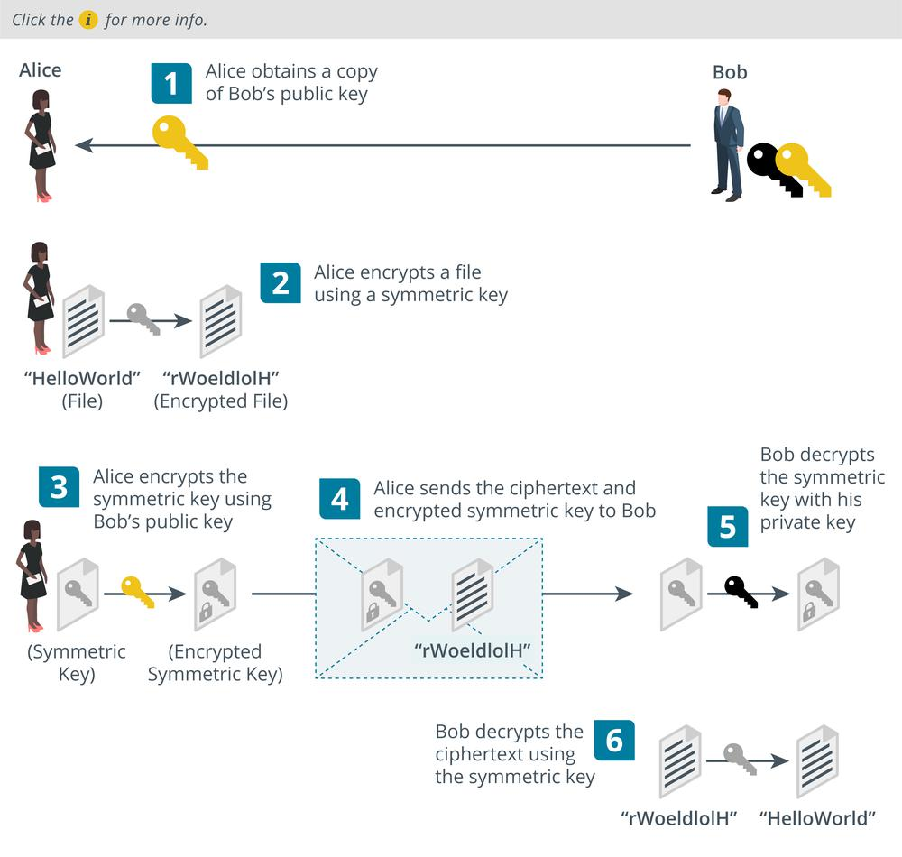

# Digital Envelopes and Key Exchange

#### DIGITAL ENVELOPES AND KEY EXCHANGE

Symmetric encryption is the only practical means of encrypting and decrypting large amounts of data (bulk encryption), but it is difficult to distribute the secret key securely. Public key cryptography makes it easy to distribute a key, but can only be used efficiently with small amounts of data. Therefore, both are used within the same product in a type of **key exchange** system known as a digital envelope or hybrid encryption. A digital envelope allows the sender and recipient to exchange a symmetric encryption key securely by using public key cryptography:

1.  Alice obtains a copy of Bob's public key.
    
2.  Alice encrypts her message using a secret key cipher, such as AES. In this context, the secret key is referred to as a session key.
    
3.  Alice encrypts the session key with Bob's public key.
    
4.  Alice attaches the encrypted session key to the ciphertext message in a digital envelope and sends it to Bob.
    
5.  Bob uses his private key to decrypt the session key.
    
6.  Bob uses the session key to decrypt the ciphertext message.

_Key exchange using a digital envelope. (Images © 123RF.com.)_

Note that in this process, it is the recipient's public key that is used to perform encryption and the recipient's private key that is used for decryption. The validity of the whole digital envelope can be proved using a message authentication code.

> _In all these implementations, it is critical that the private key be kept secure and available only to the authorized user._