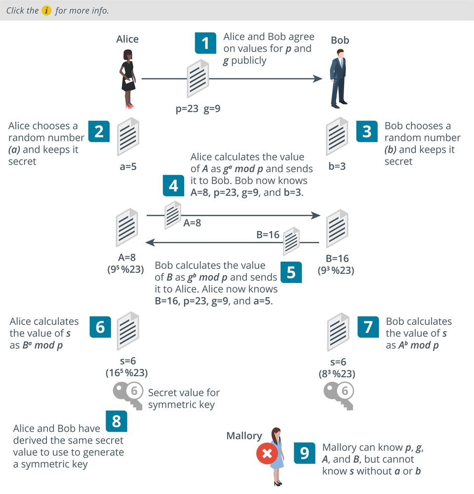

# Perfect Forward Secrecy

#### PERFECT FORWARD SECRECY

When using a digital envelope, the parties must exchange or agree upon a bulk encryption secret key, used with the chosen symmetric cipher. In the original implementation of digital envelopes, the server and client exchange secret keys, using the server's RSA key pair to protect the exchange from snooping. In this key exchange model, if data from a session were recorded and then later the server's private key were compromised, it could be used to decrypt the session key and recover the confidential session data.

This risk from RSA key exchange is mitigated by **perfect forward secrecy (PFS)**. PFS uses **Diffie-Hellman (DH)** key agreement to create **ephemeral** session keys without using the server's private key. Diffie-Hellman allows Alice and Bob to derive the same shared secret just by agreeing some values that are all related by some trapdoor function. In the agreement process, they share some of them, but keep others private. Mallory cannot possibly learn the secret from the values that are exchanged publicly ([wikipedia]](en.wikipedia.org/wiki/Diffie%E2%80%93Hellman\_key\_exchange)). The authenticity of the values sent by the server is proved by using a digital signature.

_Using Diffie-Hellman to derive a secret value to use to generate a shared symmetric encryption key securely over a public channel. (Images © 123RF.com.)_

Using ephemeral session keys means that any future compromise of the server will not translate into an attack on recorded data. Also, even if an attacker can obtain the key for one session, the other sessions will remain confidential. This massively increases the amount of cryptanalysis that an attacker would have to perform to recover an entire "conversation."

PFS can be implemented using either the **Diffie-Hellman Ephemeral mode (DHE or EDH) or Elliptic Curve Diffie-Hellman Ephemeral mode (ECDHE)** algorithms. To use PFS, the server and client must negotiate use of a mutually supported cipher suite.

> _In 2014, a Heartbleed bug was discovered in the way some versions of OpenSSL work that allows remote users to grab 64K chunks of server memory contents ([heartbleed.com](https://course.adinusa.id/sections/perfect-forward-secrecy)). This could include the private key, meaning that any communications with the server could be compromised. The bug had been present for around two years. This illustrates the value of PFS, but ironically many servers would have been updated to the buggy version of OpenSSL to enable support for PFS._