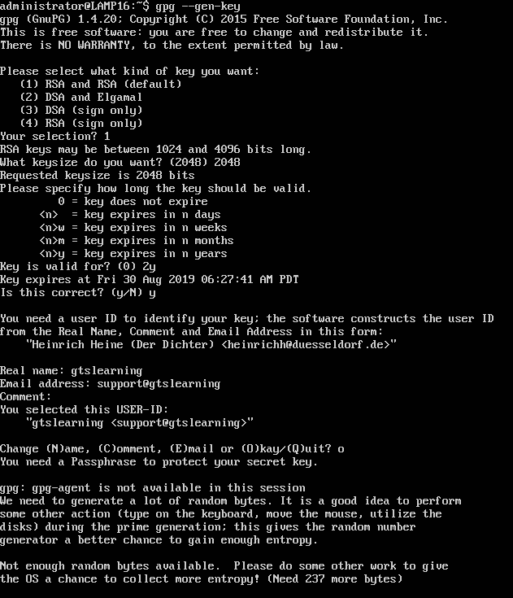

# Cryptographic Security Limitations

#### CRYPTOGRAPHIC SECURITY LIMITATIONS

Resource constraints may require you to make a tradeoff between security and performance, but you cannot trade too far.

**Entropy and Weak Keys**  
**Entropy** is a measure of disorder. A plaintext will usually exhibit low entropy as it represents a message in a human language or programming language or data structure. The plaintext must be ordered for it to be intelligible to a person, computer processor, or database. One of the requirements of a strong cryptographic algorithm is to produce a disordered ciphertext. Put another way, the ciphertext must exhibit a high level of entropy. If any elements of order from the plaintext persist, it will make the ciphertext vulnerable to cryptanalysis, and the algorithm can be shown to be weak.

It is important to realize that just because an algorithm, such as AES, is considered strong does not mean that the implementation of that cipher in a programming library is also strong. The implementation may have weaknesses. It is vital to monitor the status of this type of programming code and apply updates promptly. If a weakness is revealed, any keys issued under the weak version must be replaced and data re-encrypted.

A weak key is one that produces ciphertext that is lower entropy than it should be. If a key space contains weak keys, the technology using the cipher should prevent use of these keys. DES and **RC4** are examples of algorithms known to have weak keys. The way a cipher is implemented in software may also lead to weak keys being used. An example of this is a bug in the pseudo-random number generator for the OpenSSL server software for Debian Linux, discovered in 2008 ([wiki SSLkeys](wiki.debian.org/SSLkeys)). A weak number generator leads to many published keys sharing a common factor. A cryptanalyst can test for the presence of these factors and derive the whole key much more easily. Consequently, the **true random number generator (TRNG)** or **pseudo RNG (PRNG)** module in the cryptographic implementation is critical to its strength.

_Pseudo RNG working during key generation using GPG. This method gains entropy from user mouse and keyboard usage._

> _You can read more about true versus pseudo random number generation at [random.org.](https://course.adinusa.id/sections/cryptographic-security-limitations)_

**Predictability and Reuse**  
_Predictability_ is a weakness in either the cipher operation or within particular key values that make a ciphertext lower entropy and vulnerable to cryptanalysis. Reuse of the same key within the same session can cause this type of weakness. The RC4 stream cipher and some chained block modes of operation are not as secure as other cipher modes, because they exhibit predictability. Often, it is necessary to use an additional random or pseudo-random value in conjunction with the cipher:

-   **Nonce**—the principal characteristic of a nonce is that it is never reused ("number used once") within the same scope (that is, with the same key value). It could be a random or pseudo-random value, or it could be a counter value.
    
-   Initialization vector (IV)—the principal characteristic of an IV is that it be random (or pseudo-random). There may also be a requirement that an IV not be reused (as with a nonce), but this is not the primary characteristic.
    
-   **Salt**—this is also a random or pseudo-random number or string. The term _salt_ is used specifically in conjunction with hashing password values.
