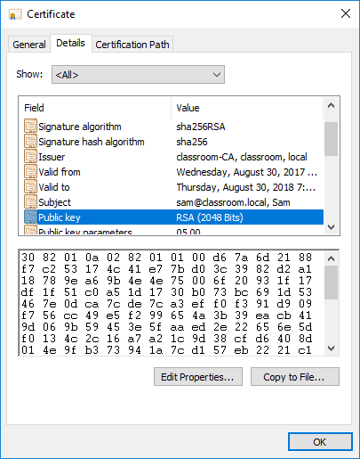

# Digital Certificates

#### DIGITAL CERTIFICATES

A **digital certificate** is essentially a wrapper for a subject's public key. As well as the public key, it contains information about the subject and the certificate's issuer or guarantor. The certificate is digitally signed to prove that it was issued to the subject by a particular CA. The subject could be a human user (for certificates allowing the signing of messages, for instance) or a computer server (for a web server hosting confidential transactions, for instance).

_Digital certificate details. (Screenshot used with permission from Microsoft.)_

Digital certificates are based on the X.509 standard approved by the International Telecommunications Union and standardized by the Internet Engineering Taskforce ([tools.ietf.org/html/rfc5280](https://course.adinusa.id/sections/digital-certificates-1)). The Public Key Infrastructure (PKIX) working group manages the development of these standards. RSA also created a set of standards, referred to as **Public Key Cryptography Standards (PKCS)**, to promote the use of public key infrastructure.