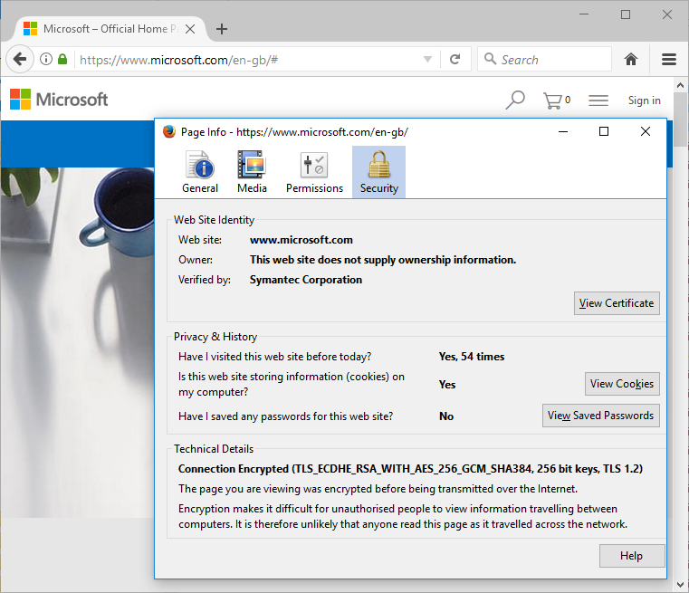
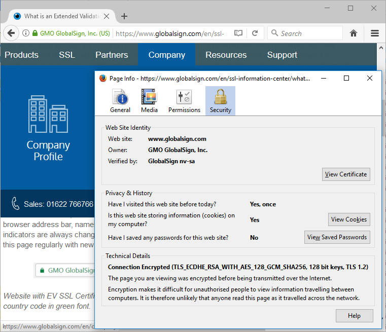
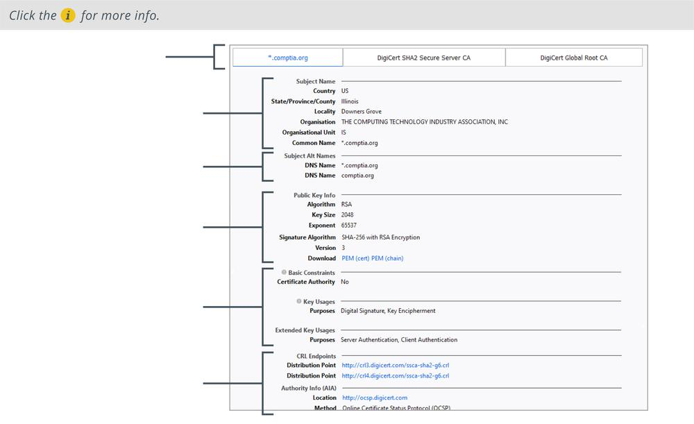

# Web Server Certificate Types

#### WEB SERVER CERTIFICATE TYPES

A **server certificate** guarantees the identity of e-commerce sites or any sort of website to which users submit data that should be kept confidential. One of the problems with public key cryptography and trust models is that anyone can set up a PKI solution. It is also simple to register convincing-sounding domain names, such as my-bank-server.foo, where the "real" domain is mybank.foo. If users choose to trust a certificate in the naïve belief that simply having a certificate makes a site trustworthy, they could expose themselves to fraud. There have also been cases of disreputable sites obtaining certificates from third-party CAs that are automatically trusted by browsers that apparently validate their identities as financial institutions.

Differently graded certificates might be used to provide levels of security; for example, an online bank requires higher security than a site that collects marketing data.

-   Domain Validation (DV)—proving the ownership of a particular domain. This may be proved by responding to an email to the authorized domain contact or by publishing a text record to the domain. This process can be highly vulnerable to compromise.

_Domain validation certificate. Only the padlock is shown and the browser reports that the owner is not verified. (Screenshot used with permission from Microsoft.)_

-   Extended Validation (EV)—subjecting to a process that requires more rigorous checks on the subject's legal identity and control over the domain or software being signed. EV standards are maintained by the CA/Browser forum ([cabforum.org](https://course.adinusa.id/sections/web-server-certificate-types)). An EV certificate cannot be issued for a wildcard domain.

_Extended validation certificate from GlobalSign with the verified owner shown in green next to the padlock. (Screenshot used with permission from GlobalSign, Inc.)_

_Selected fields in a digital certificate viewed from the Firefox browser._