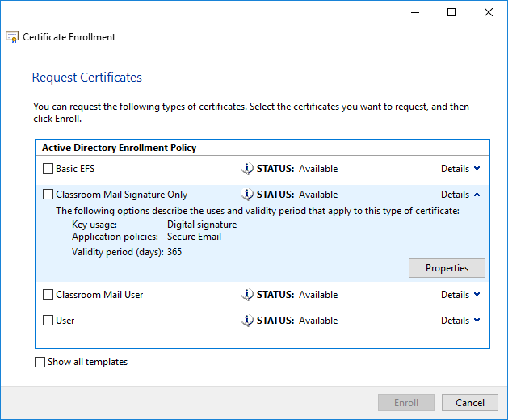

# Other Certificate Types

#### OTHER CERTIFICATE TYPES

Web servers are not the only systems that need to validate identity. There are many other certificate types, designed for different purposes.

**Machine/Computer Certificates**  
It might be necessary to issue certificates to machines (servers, PCs, smartphones, and tablets), regardless of function. For example, in an Active Directory domain, machine certificates could be issued to Domain Controllers, member servers, or even client workstations. Machines without valid domain-issued certificates could be prevented from accessing network resources. Machine certificates might be issued to network appliances, such as routers, switches, and firewalls. The SAN and often the CN attribute should be set to the FQDN of the machine (host name and local domain part).

**Email/User Certificates**  
An _email certificate_ can be used to sign and encrypt email messages, typically using Secure Multipart Internet Message Extensions (S/MIME) or Pretty Good Privacy (PGP). The user's email address must be entered as the SAN and CN. On a directory-based local network, such as Windows Active Directory, there may be a need for a wider range of user certificate types. For example, in AD there are user certificate templates for standard users, administrators, smart card logon/users, **recovery agent** users, and Exchange mail users (with separate templates for signature and encryption). Each certificate template has different key usage definitions.

_Requesting a certificate. The CA has made several user-type certificate templates available with different key usage specifications (encrypting files, signing emails, encrypting emails, and so on). (Screenshot used with permission from Microsoft.)_

**Code Signing Certificates**  
A **code signing** certificate is issued to a software publisher, following some sort of identity check and validation process by the CA. The publisher then signs the executables or DLLs that make up the program to guarantee the validity of a software application or browser plug-in. Some types of scripting environments, such as PowerShell, can also require valid digital signatures. The CN is set to an organization name, such as "CompTIA Development Services, LLC," rather than a FQDN.

**Root Certificate**  
The **root certificate** is the one that identifies the CA itself. The root certificate is self-signed. A root certificate would normally use a key size of at least 2048 bits. Many providers are switching to 4096 bits. The CN for a root certificate is set to the organization/CA name, such as "CompTIA Root CA," rather than an FQDN.

**Self-signed Certificates**  
Any machine, web server, or program code can be deployed with a **self-signed certificate**. Self-signed certificates will be marked as untrusted by the operating system or browser, but an administrative user can choose to override this.