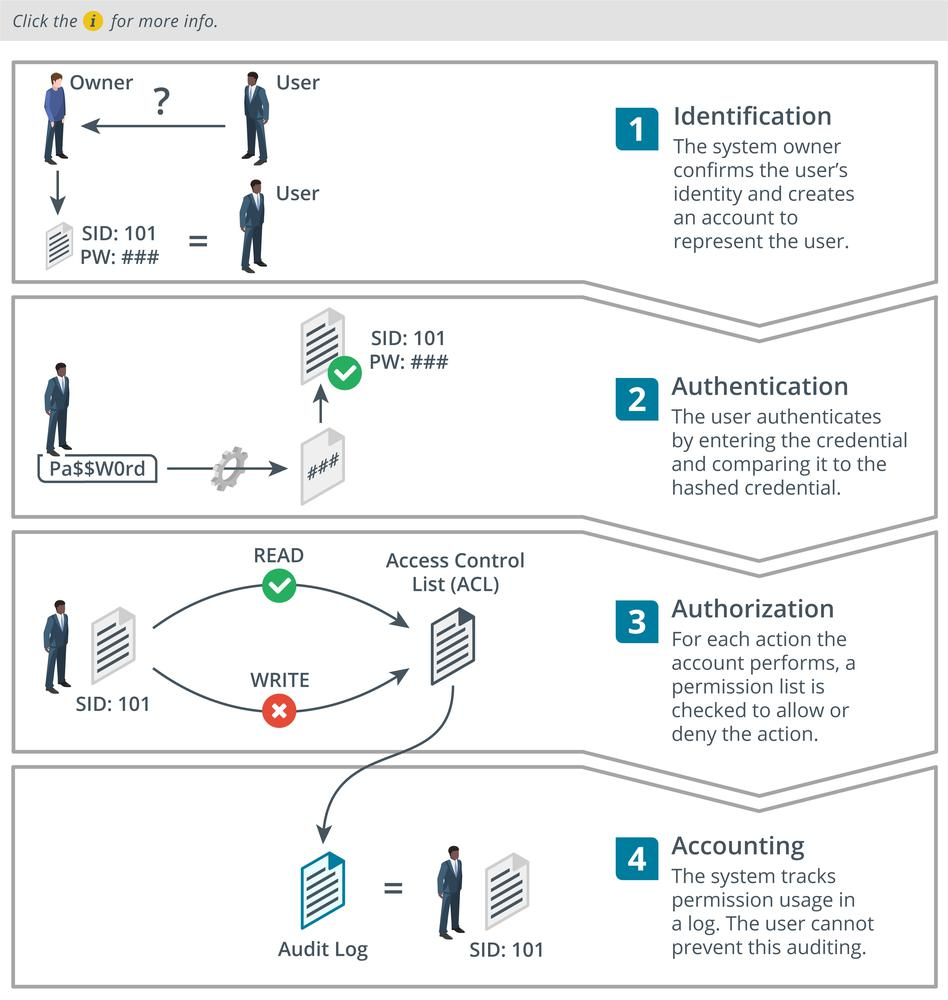

# Identity and Access Management

#### IDENTITY AND ACCESS MANAGEMENT

An access control system is the set of technical controls that govern how subjects may interact with objects. Subjects in this sense are users, devices, or software processes, or anything else that can request and be granted access to a resource. Objects are the resources; these could be networks, servers, databases, files, and so on. An **identity and access management (IAM)** system is usually described in terms of four main processes:

-   **Identification**—creating an account or ID that uniquely represents the user, device, or process on the network.
    
-   **Authentication**—proving that a subject is who or what it claims to be when it attempts to access the resource.
    
-   **Authorization**—determining what rights subjects should have on each resource, and enforcing those rights.
    
-   **Accounting**—tracking authorized usage of a resource or use of rights by a subject and alerting when unauthorized use is detected or attempted.

_Differences among identification, authentication, authorization, and accounting. (Images © 123RF.com.)_

IAM enables you to define the attributes that make up an entity's identity, such as its purpose, function, security clearance, and more. These attributes subsequently enable access management systems to make informed decisions about whether to grant or deny an entity access, and if granted, decide what the entity has authorization to do. For example, an individual employee may have his or her own identity in the IAM system. The employee's role in the company factors into his or her identity, such as what department the employee is in and whether the employee is a manager. For example, if you are setting up an e-commerce site and want to enroll users, you need to select the appropriate controls to perform each function:

-   Identification—ensure that customers are legitimate. For example, you might need to ensure that billing and delivery addresses match and that they are not trying to use fraudulent payment methods.
    
-   Authentication—ensure that customers have unique accounts and that only they can manage their orders and billing information.
    
-   Authorization—rules to ensure customers can place orders only when they have valid payment mechanisms in place. You might operate loyalty schemes or promotions that authorize certain customers to view unique offers or content.
    
-   Accounting—the system must record the actions a customer takes (to ensure that they cannot deny placing an order, for instance).
    

The servers and protocols that implement these functions are referred to as **authentication, authorization, and accounting (AAA)**. The use of IAM to describe enterprise processes and workflows is becoming more prevalent as the importance of the identification phase is better acknowledged.