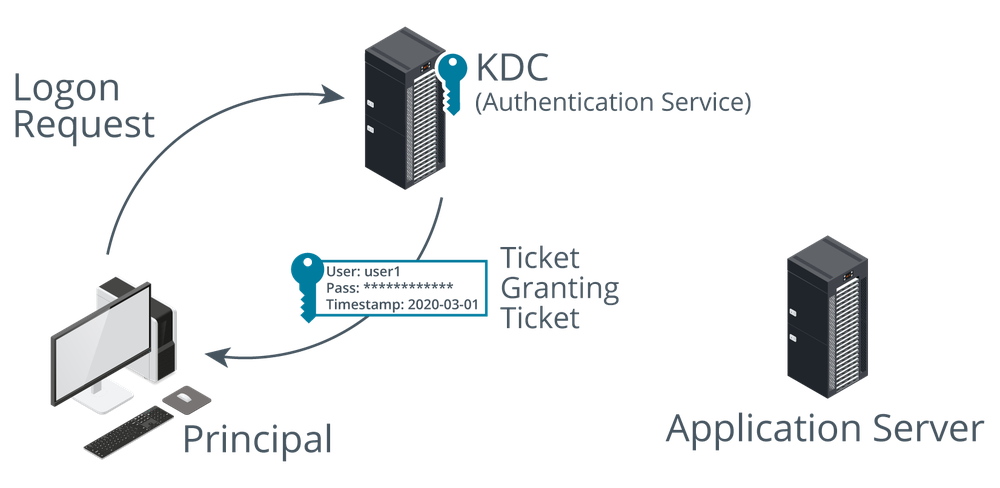

# Kerberos Authentication

#### KERBEROS AUTHENTICATION

**Kerberos** is a single sign-on network authentication and authorization protocol used on many networks, notably as implemented by Microsoft's Active Directory (AD) service. Kerberos was named after the three-headed guard dog of Hades (Cerberus) because it consists of three parts. Clients request services from application servers, which both rely on an intermediary—a **Key Distribution Center (KDC)**—to vouch for their identity. There are two services that make up a KDC: the Authentication Service and the Ticket Granting Service. The KDC runs on port 88 using TCP or UDP.

_Kerberos Authentication Service. (Images © 123RF.com.)_

The Authentication Service is responsible for authenticating user logon requests. More generally, users and services can be authenticated; these are collectively referred to as _principals_. For example, when you sit at a Windows domain workstation and log on to a realm (or domain), the first step of logon is to authenticate with a KDC server, implemented as a domain controller.

1.  The client sends the authentication service (AS) a request for a **Ticket Granting Ticket (TGT)**. This is composed by encrypting the date and time on the local computer with the user's password hash as the key.

> The password hash itself is not transmitted over the network. Also, although we refer to passwords for simplicity, the system can use other authentication providers, such as smart-card logon.
> 
> The Ticket Granting Ticket (TGT; or user ticket) is time-stamped (under Windows, they have a default maximum age of 10 hours). This means that workstations and servers on the network must be synchronized (to within five minutes) or a ticket will be rejected. This helps prevent replay attacks.

1.  The AS checks that the user account is present, that it can decode the request by matching the user's password hash with the one in the Active Directory database, and that the request has not expired. If the request is valid, the AS responds with the following data:
    
2.  Ticket Granting Ticket (TGT)—this contains information about the client (name and IP address) plus a timestamp and validity period. This is encrypted using the KDC's secret key.
    
3.  TGS session key for use in communications between the client and the Ticket Granting Service (TGS). This is encrypted using a hash of the user's password.
    

The TGT is an example of a logical token. All the TGT does is identify who you are and confirm that you have been authenticated—it does not provide you with access to any domain resources.